# 启元 Linux（Qiyuan Linux）

一个从零开始的自建 Linux 发行版工程。工具链自己控制，包格式与包管理器自己实现，
构建配方自己定义，软件以上游源码为输入。

当前状态：**地基已完工并跑通端到端验证**——从配方到可运行软件的完整链路可用。

```
配方 → 沙箱构建 → 独立安装目录 → .qyp 包（签名）→ 仓库索引（验签）→ 包管理器安装 → 可运行
```

---

## 一、已经做出来的东西

### 1. 自建包格式 `.qyp`

单文件三段式容器（`qyos/format.py`）：

| 段 | 内容 | 作用 |
|---|---|---|
| header 128B | 魔数、版本、段偏移与长度、段哈希 | 不解压就能定位与校验 |
| meta | JSON 元数据：依赖、provides、文件清单（含 sha256）、安装脚本 | 快速查询、依赖求解、完整性校验 |
| data | tar.gz 数据段，路径相对根目录 | 实际文件 |
| sig | ed25519 对 (meta+data) 哈希的签名，可分离 | 防篡改 |

### 2. 构建系统 `qybuild`

- 配方是纯 Python 模块（`recipes/*.py`）：声明式字段 + `build()` / `package()` 两段式
- 构建隔离：统一 PATH 与编译参数、清空宿主侵入变量、命名空间 + 默认断网（`unshare -n`）
- **构建依赖自动装进 sysroot**，头文件与库路径注入构建环境——这是通向交叉编译的接口
- 编译基线一次定好全系统生效：`-fstack-protector-strong -D_FORTIFY_SOURCE=2 -Wl,-z,relro,-z,now`
- 边构建边入库，后面的包才能拿到前面的依赖
- 幂等：已构建的包自动跳过，`--force` 强制重编

### 3. 包管理器 `qypkg`

- 依赖求解：版本约束、虚拟包与提供者、冲突检测、循环依赖检测、拓扑排序
- 事务化安装：先算完整变更集 → 校验 → 写入，**失败按日志回滚**
- 显式安装 / 依赖安装分开标记，可清理孤儿包
- 已安装包存 SQLite：查文件归属、反查依赖者、校验文件是否被改动
- 卸载保护：仍被依赖的包拒绝卸载

### 4. 仓库 `qyrepo`

- 索引记录每个包的 sha256，安装时按索引校验包文件
- 索引必须签名，篡改索引会被明确拒绝
- 密钥 ed25519，密钥 ID 可核对

### 5. 根文件系统与 init

`filesystem` 包提供 FHS 骨架和 `/usr` 合并布局（`/bin` `/sbin` `/lib` 指向 `/usr`），
外加基础 `/etc`。`qyinit` 是一个真正能用的 1 号进程，C 语言实现：

- 挂载 `/proc` `/sys` `/dev`，创建必要设备节点
- 读服务单元、按依赖拓扑排序启动、停机时逆序停止
- 回收孤儿进程（1 号进程的天职）
- 按 `Restart=` 策略拉起崩溃的服务，并带**崩溃风暴限流**（10 秒内最多 5 次）
- 收到 SIGTERM 走正常关机流程

`qypkg assemble` 把一组包组装成可启动的根，`bootcheck` 检查它能不能开机
（init 在不在、合并布局生效没、动态库缺不缺），`manifest` 生成完整清单可比对
两台机器装出来是否一致。

### 6. 内核配置管理 `qyos/kernel.py`

配置项上万条，手写 `.config` 不可维护。做法是一个基线 + 若干片段叠加：

```bash
./bin/qybuild --kernel-config --arch x86_64 \
  --fragment kernel/config/base-x86_64.fragment \
  --fragment kernel/config/hardening.fragment \
  --out kernel/config/merged.config
```

必需项（initramfs 支持、devtmpfs、futex、EFI…）和禁用项（强制模块签名、
KGDB…）写成清单，每次构建强制校验。这份清单本身就是发行版的安全姿态声明。

### 7. initramfs 构建器 `qyos/initramfs.py`

内核不会直接挂真根——它挂 initramfs，由里面的程序找到真根再切过去。
这里用纯 Python 手写 cpio(newc) + gzip，不依赖外部 `cpio` 命令，产物可复现。

早期 init 用 C 写成并**强制静态链接**：它运行时 `/usr/lib` 还没挂载，
动态链接器找不到 libc，一执行就段错误。这是新手最容易踩的坑，
`inspect` 会把它当作硬性检查项。

```bash
./bin/qybuild --initramfs --out var/boot/initramfs.img
```

### 8. 自举分析 `qyos/bootstrap.py`

自举 = 用这套系统重建这套系统，是"原创发行版"和"套壳改版"的分界线。
三关：

1. **工具链关**：用宿主编译器编出自己的 gcc/binutils
2. **系统关**：用第一遍工具链编出全套基础系统，产物不得链接宿主任何库
3. **自持关**：用第二遍的系统重编所有包，逐字节一致（可复现构建）

```bash
./bin/qybuild --bootstrap
```

会算出构建闭包、检测循环构建依赖、按关分批、报出阻塞项。

### 9. 磁盘分区与镜像 `qyos/disk.py` `qyos/bootloader.py` `qyos/image.py`

装机最容易出事的地方就是分区。把方案变成可校验的数据，再生成分步脚本：

```bash
./bin/qydisk layout  --disk /dev/nvme0n1 --size 200G --memory 16G
./bin/qydisk scripts --disk /dev/sda --size 100G --out var/install/scripts
./bin/qydisk image   --target /tmp/root --image-size 4G
```

几个刻意做的决策：

- **fstab 一律用 UUID**，不用 `/dev/sda1`。设备名在加装硬盘、换接口后会漂移，
  这是"昨天还好好的今天起不来"的头号原因
- **swap 跟着内存走**：<2G 给 2 倍，8~64G 给一半（上限 8G），>64G 固定 4G
- **EFI 分区按挂载点判定而非文件系统**——按 fs 判的话，
  "EFI 分区误设成 ext4"就查不出来，而那恰恰是最该拦住的错误
- **NVMe/MMC 的分区名带 p**（`nvme0n1p1` vs `sda1`），写死 sda1 会分错盘
- **GRUB 配置必须带一个非静默的救援项**：系统起不来时第一件事就是看内核输出，
  只给一个 quiet 项是给自己找麻烦
- **装机脚本拆成 6 步**，每步可单独重跑，失败不用从头再来
- **清空磁盘前强制二次确认**，并先 `wipefs` 清旧签名

### 10. 安全响应 `qyos/security.py`

系统发布只是开始，真正考验发行版的是出事之后。CVE 公布后，
多久能知道哪些包受影响、多久能出修复包、用户多久能拿到。

```bash
./bin/qysec scan --root /mnt/system      # 这台机器上有什么没修
./bin/qysec by-cve --cve CVE-2026-0001   # 某个 CVE 影响哪些包
./bin/qysec rebuild --changed glibc      # 改了这个包，谁要跟着重编
```

两个刻意做对的地方：

- **按版本区间判定，不是按版本号相等**。CVE 影响 1.2~2.0，
  只查 `version == 1.2` 会漏掉绝大多数受影响的安装
- **改一个包要算出谁要重编**。共享库一改，所有链接它的包都得重编，
  只发新库不发依赖方，运行时会炸

### 11. 系统形态 `qyos/profile.py`

同一个发行版可以长成不同样子：容器最小系统、服务器、桌面、开发工作站。
差别不在内核和包管理器，而在**选哪些包 + 怎么配置**。

```bash
./bin/qyrelease profiles --profile server
```

形态必须**声明它排除了什么**——只写"包含桌面"不写"不装打印服务"，
用户拿到手才知道少了什么。

### 12. 发布工程 `qyos/release.py`

```bash
./bin/qyrelease bump --version 0.1.0-rc.2 --bump promote   # → 0.1.0
./bin/qyrelease manifest --dir var/release --sign var/repo/keys/qiyuan
./bin/qyrelease verify  --dir var/release --pubkey var/repo/keys/qiyuan.pub
./bin/qyrelease changelog --version 0.1.0
```

**发布清单里每个产物都有 sha256，清单本身也签名**。只发镜像不发校验和，
用户无法判断自己拿到的是不是被中间人换过的东西。

### 13. 自动依赖发现 `qyos/shlibdeps.py`

扫产物 ELF 的 DT_NEEDED → 反查哪个包提供该 soname → 自动补进 depends。

```bash
./bin/qybuild --shlibdeps qydemo
```

手工维护依赖必然遗漏（忘写 glibc 最常见），后果是装包时报"找不到共享库"，
且安全扫描会漏。只加不删——自动分析看不出"还需要某个数据文件包"。

### 14. 循环依赖处理 `qyos/cycles.py`

包库到 166 个时撞上了一个真实的环：

```
cairo → fontconfig → freetype → harfbuzz → cairo
```

```bash
./bin/qybuild --cycles
```

用 Tarjan 强连通分量一次找全所有环（而不是遇到一个崩一个），
配方用 `cycle_break` 声明断在哪一侧，然后两遍构建：
先编断开版，环上包齐了再重编。**忘了重编，系统会带着一个不支持复杂文本
排版的 freetype 发布出去——能跑、能过测试，中文和阿拉伯文渲染是错的。**

### 15. 工具链引导器 `bootstrap/bootstrap.py`

把 Linux From Scratch 的手工步骤变成**可无人值守、可断点续跑**的自动化流程：
宿主检查 → 下载校验 → 交叉 binutils → 交叉 gcc（无 libc）→ 内核头文件 → glibc →
libstdc++ → 完整交叉编译器 → 工具链自检。每阶段幂等、写检查点、日志分离。

版本基线已按 **LFS 12.4（2025-09-01 发布）** 核对：binutils-2.45、gcc-15.2.0、
glibc-2.42、linux-6.16.1。其余条目在 `bootstrap/versions.json` 中标为 TODO，
开工当天从 LFS 官方书填充实际版本，不要沿用过期值。

---

## 二、马上可以跑

```bash
cd qiyuan

# 生成签名密钥（只需一次）
./bin/qybuild --gen-key var/repo/keys/qiyuan

# 构建全部配方（含依赖求解、sysroot 依赖安装、签名入库）
./bin/qybuild all --sign var/repo/keys/qiyuan

# 查看仓库
./bin/qyrepo list --pubkey var/repo/keys/qiyuan.pub

# 安装到某个根（/ 就是装到本机，也可以指向任意目录或挂载的系统）
./bin/qypkg --root /tmp/qyroot install qydemo

# 跑起来
LD_LIBRARY_PATH=/tmp/qyroot/usr/lib /tmp/qyroot/usr/bin/qydemo
# → qydemo 0.1.0
#   1 + 2 = 3

# 端到端冒烟测试（16 项检查）
./tests/smoke.sh        # 地基链路 18 项
./tests/upgrade.sh      # 升级与回滚 19 项
./tests/system.sh       # 根文件系统与 init 27 项
./tests/boot.sh         # 内核配置 / initramfs / 自举分析 17 项
./tests/install.sh      # 分区 / fstab / 引导器 / 装机脚本 / 镜像 15 项
./tests/security.sh     # 安全响应 / 系统形态 / 发布工程 20 项
./tests/deps.sh         # 自动依赖发现 / 循环依赖 / 大规模依赖图 20 项
```

组装一个能启动的根并实测 init：

```bash
./bin/qypkg --root /tmp/qyroot assemble filesystem qyinit qydemo
./bin/qypkg --root /tmp/qyroot bootcheck
/tmp/qyroot/usr/bin/qyinit --unit-dir /tmp/qyroot/etc/qyinit.d \
    --log /tmp/boot.log --oneshot
```

工具链引导（需要约 30G 磁盘、宿主装有 bison/flex/gawk 等）：

```bash
python3 bootstrap/bootstrap.py plan            # 看阶段计划
python3 bootstrap/bootstrap.py preflight       # 检查宿主环境
python3 bootstrap/bootstrap.py run             # 开始引导
python3 bootstrap/bootstrap.py run --from gcc-p1   # 断了从某阶段继续
```

---

## 三、已验证的能力（16 项冒烟测试全绿）

| 能力 | 验证方式 |
|---|---|
| 配方树解析与依赖排序 | 全量构建按正确顺序完成 |
| 构建依赖隔离安装 | libqydemo 自动装进 sysroot 后 qydemo 才编译 |
| 包格式自洽 | 每个 .qyp 的 meta/data 段哈希校验通过 |
| 索引验签 | 篡改 index.json 后安装被明确拒绝 |
| 包文件校验 | 仓库包哈希与索引记录全部匹配 |
| 依赖自动安装 | 装 qydemo 自动带上 libqydemo |
| 真实可运行 | 安装后的二进制能执行并输出正确结果 |
| 完整性校验 | 能检出文件被篡改 |
| 依赖保护 | 拒绝卸载仍被依赖的包 |
| 卸载干净 | 递归卸载后无残留文件 |

---

## 四、还没有做的（对应 12 个月路线图）

| 阶段 | 内容 | 状态 |
|---|---|---|
| 地基期 | 工具链引导器 | 结构完成，需在真实构建机上跑通 |
| 包与仓库期 | 原子升级、并行下载、系统级回滚 | **已完成**（19 项测试） |
| 包与仓库期 | 原子升级、并行下载、系统级回滚 | 单包事务回滚已有，系统级快照待做 |
| 系统成型期 | 根文件系统、init、内核配置、initramfs、自举分析 | 结构**已完成**（44 项测试）；真机编译待做 |
| 装机与镜像期 | 分区方案、fstab、引导器、装机脚本、镜像 | **已完成**（15 项测试）；真机装机待做 |
| 安全与发布期 | 漏洞响应、系统形态、发布工程 | **已完成**（20 项测试） |
| 包库与依赖期 | 166 个配方、自动依赖发现、循环依赖打破 | **已完成**（20 项测试） |
| 装机与形态期 | 安装器、ISO、桌面与服务器形态 | 待做 |
| 产品级稳定期 | 安全响应、CI、文档体系、1.0 | 待做 |

**判断：能不能叫原创发行版，取决于自举能否打通**——用这套系统重建这套系统，
不再依赖任何宿主发行版。地基已完成，剩下的时间是确定的工程量，不是未知数。

---

## 五、目录结构

```
qiyuan/
├── qyos/            内核模块（格式/配方/沙箱/依赖/构建/仓库/包管理）
├── bin/             qybuild · qypkg · qyrepo
├── recipes/         构建配方（*.py）
├── bootstrap/       工具链引导器 + 版本配置
├── tests/           演示源码 · 端到端冒烟测试
├── var/
│   ├── pkgs/        构建产物 *.qyp
│   ├── repo/        仓库（索引、签名、密钥）
│   ├── sysroot/     构建依赖安装点
│   └── work/        构建中间目录
└── docs/            设计说明
```

## 六、给维护者的三条硬规矩

1. **远程源码必须锁 sha256**，本地源码目录可以留空。没有校验和就没有可复现。
2. **构建默认断网**。构建期偷偷联网的包，结果不可复现，也不安全。
3. **先保可复现，再谈功能**。构建流水线死了，进度就归零。

---

## 七、桌面环境进展（2026-10 实测）

**ISO v0.9 已在 QEMU 实测达成桌面闭环**：

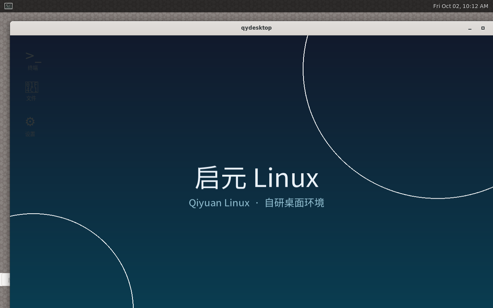
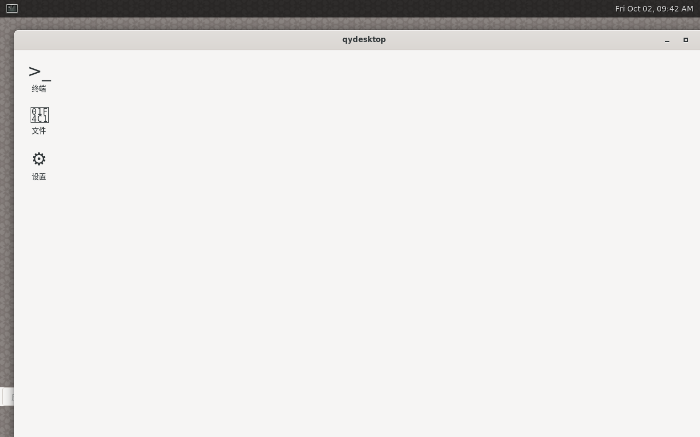 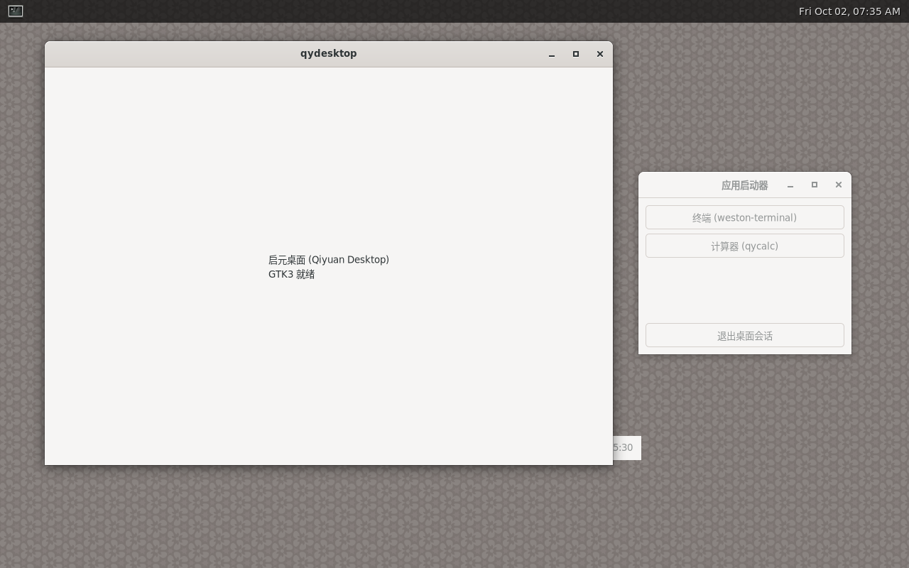

- **内核**：linux 6.16.1（defconfig 基底 + DRM_BOCHS/DRM_VIRTIO_GPU/SQUASHFS/USB_HID/fbcon 等）
- **显示**：bochs-drm 加载 → seatd 会话 → udevd 设备枚举 → weston 14.0.2 DRM backend (pixman) 真上屏
- **桌面 qydesktop**（GTK3，`recipes/qydesktop.c`）：
  - 品牌壁纸（cairo + gdk-pixbuf 铺满，PIL 程序化生成）
  - 桌面图标（终端/文件/设置，点击 g_spawn 拉起）
  - 应用启动器窗口、顶栏（全宽 + 时钟）
- **文件管理器 qyfiles**（`recipes/qyfiles.c`）：目录导航、类型列、位置状态栏
- **中文渲染**：DejaVu + Noto Sans CJK（145 号包，Ubuntu pool 源 + sha256 锁定）
- **自研 init qyinit**：unit 依赖编排 + /dev/shm tmpfs + 崩溃重启

关键坑位记录（详见 git log）：grub-mkrescue 必须重跑（只 mksquashfs 不生效）、
udevd 缺席会让 libinput 枚举不到输入设备、qyinit unit `After=` 暂不生效需 sleep 兜底、
系统无字体时 Pango 会把窗口算成 65535px 高。

## 桌面一览（QEMU 实测截图）

| 桌面（中文+Noto CJK） | 品牌壁纸桌面 |
|---|---|
| 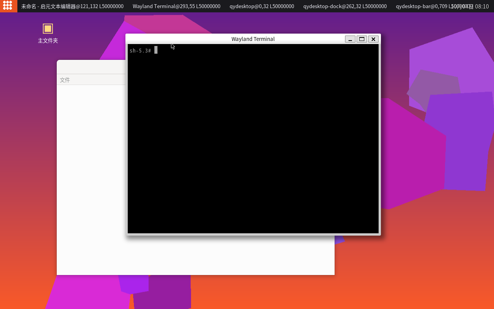 |  |

**开始菜单**（搜索 + 固定应用网格 + 常用列表）：

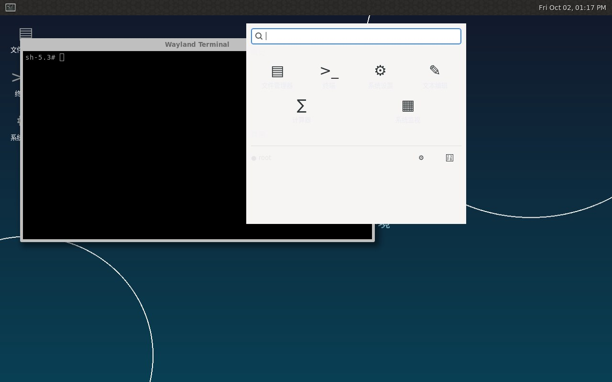

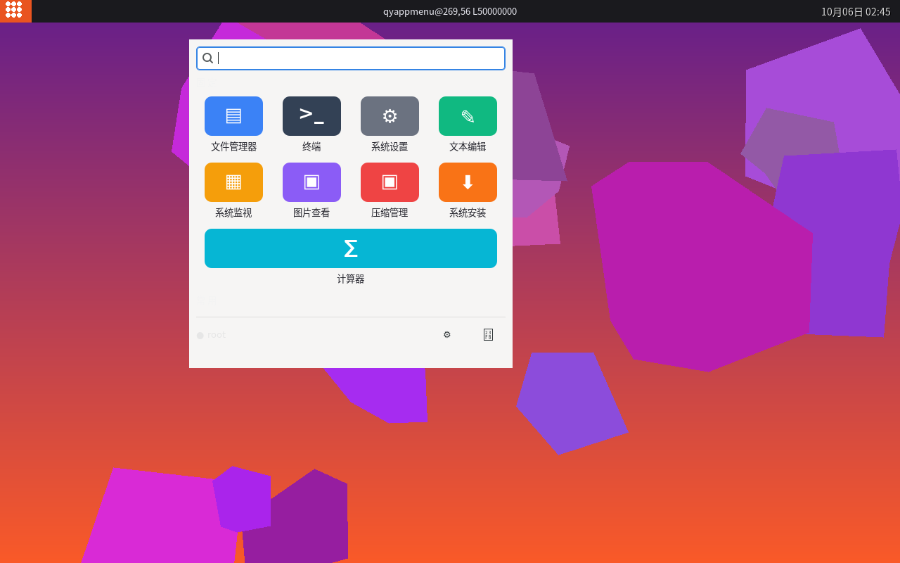
*v1.7 统一图标主题：cairo 圆角色块 + 9 色板 + 深灰高对比标签*
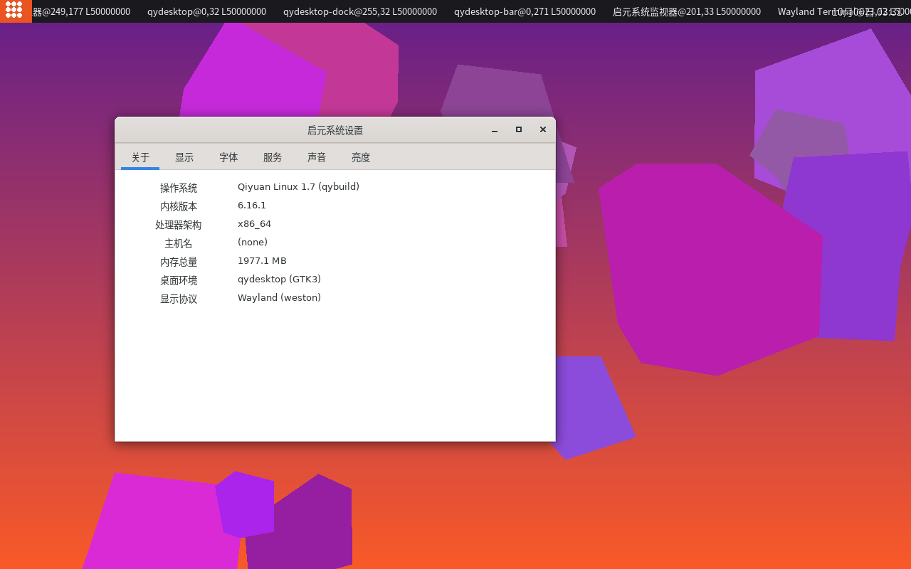
*v1.7.0 系统设置：关于页 Qiyuan Linux 1.7 + 声音/亮度页实际生效（ALSA Master / backlight）*
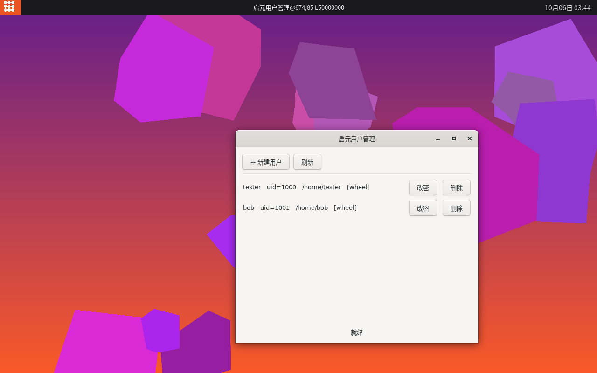
*v1.7.1 用户管理 qyusers：用户列表 / 新建 / 改密 / 删除 / wheel 组标记*


## 桌面环境 v1.1.1（2026-10-04，QEMU 实测）

**渲染消失病已根治**：应用窗口在点击后不再被桌面壳层遮挡——

| 修复后桌面（多次点击窗口全部保持） |
|---|
| 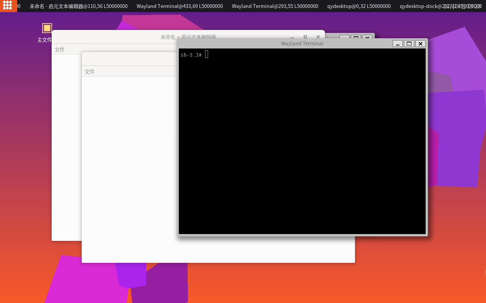 |

- **窗口管理**：weston 14.0.2 + 自研 shell 补丁——真任务栏（按窗口列表画按钮）、点击切换焦点、qy-winop 关闭/最小化
- **壳层策略**：qydesktop/dock/bar 固定在窗口层最底且激活不抬层；任务栏主 widget 全条命中
- **文件管理器 qyfiles v2**：回收站、新建文件夹、重命名/删除、右键选中行 + 工具栏操作
- **设置 qysettings**：声音（ALSA amixer Master）、屏幕亮度（/sys/class/backlight）
- **音频栈**：alsa-lib + alsa-utils 1.2.14（147 包）
- **健壮性**：initramfs cpio 重建修复、grub.cfg 显式化、DRM 输入设备未就绪自动重试

## 桌面环境 v1.2.1（2026-10-05，QEMU 实测）

**鼠标点击链路彻底打通**（v1.1.1–v1.2.0 连续三案告破）：

1. **渲染消失病**（v1.1.1）：应用窗口点击后被壁纸窗遮挡 → map 压底 z 序方向修正
   （weston 渲染器 `wl_list_for_each_reverse` → view_list 头=最顶、尾=最底；旧补丁插头=置顶）
2. **测试工具链**：QEMU monitor `mouse_button b=1` 是静默失败语法，正确为 `mouse_button 1`（按下）+ `0`（释放）
3. **HOME 归一**（v1.2.0）：GLib `g_get_home_dir()` 优先读 `$HOME`，init 环境未设时回收站等
   `~/.local` 路径全部错位 → start-qydesktop.sh 强制 `export HOME=$(getent passwd …)`

**回收站显示 bug 根治实证**（样本数据在而列表空 = HOME 错位，非读取逻辑问题）：

| 回收站视图（修复实证） |
|---|
| 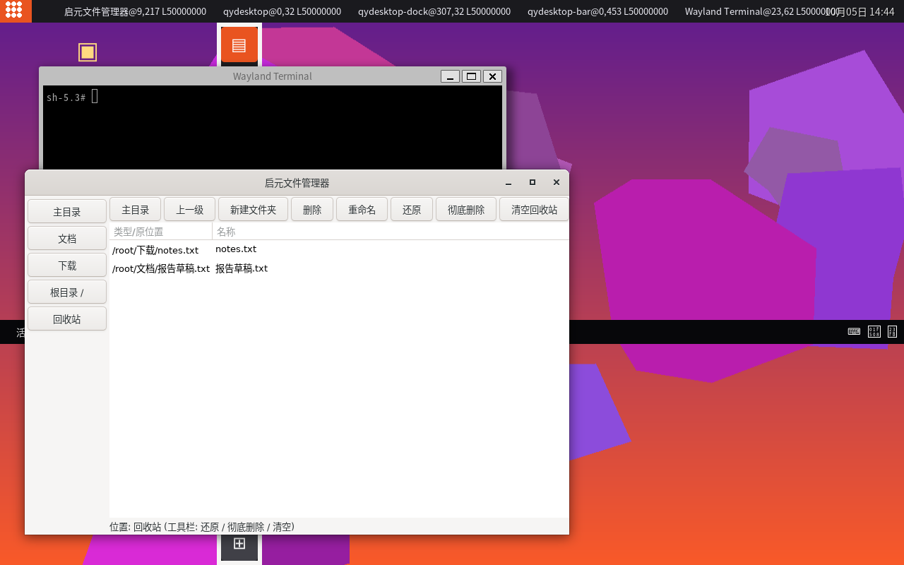 |

- qyfiles `--trash` 启动参数自证回收站视图；GtkApplication 只传 argv[0]
  （`--trash` 会被其命令行解析器判 Unknown option 静默退出——自启场景大坑）
- **qymon 系统监视器 v1**：/proc/stat CPU + /proc/meminfo 内存实时曲线（GtkDrawingArea+cairo，1s 刷新）
- **qyview 图片查看器 v1**：GdkPixbuf 打开/自适应、滚轮缩放、左右键同目录翻页、双击还原
- 应用菜单扩至 7 应用；启动器图标点击拉起应用全链路实测

**Release**：[v1.1.2](https://github.com/Quor-a/qiyuan-linux/releases/tag/v1.1.2)（ISO 1.2.0 + 全部修复）

## 开发进度与下一步

- ✅ 已完成：包管理/构建/仓库/init 内核全链路、weston 桌面+任务栏、鼠标点击闭环、
  qyfiles（回收站全功能）、qysettings（声音/亮度）、qyappmenu、qyedit、qymon、qyview（147 包）
- 🔧 进行中：qymon/qyview 启动器点击拉起的 VM 实测收尾
- 📋 下一步：
  1. 系统级完善：polkit/elogind、服务管理（qyinit 单元依赖可视化）
  2. 12 类最小集补齐（剩 音频播放器/视频播放器/文本终端增强/压缩管理器 等）
  3. qyfiles 图标视图 + qyview 缩略图浏览模式
  4. 安装器（ISO → 硬盘装机）

---

## v1.6.0（2026-10-06）

**qysudo 权限提升 + 用户管理**：

- **qysudo**（setuid-root C 程序）：/etc/qysudoers 授权（用户或 %wheel 组）→ /etc/shadow 密码校验（crypt_r SHA512，3 次重试）→ 提权执行；PATH 重置防注入；root 免密
- **用户体系**：/etc/shadow 落地（root:600）；wheel 组；qyuseradd 脚本（创建用户+home+入 wheel）
- **实测**：chroot 中 tester(wheel) 输密码 → qysudo id → uid=0(root) ✅
- 教训：/etc/shadow 里 root 为 `!`（锁定）时 sshd 拒绝一切认证（"account is locked"）→ root 必须有真实密码 hash（默认 qiyuan-root，README 提醒用户改）

下一步：统一图标主题、声音/亮度设置页、SQUASHFS_ZSTD 内核重配、qyuseradd GUI。

## v1.5.1（2026-10-06）

**qysetup 系统安装器 GUI**（应用菜单第 9 项「系统安装」）：

- 磁盘枚举（/sys/block，过滤小盘/sr），二次确认对话框，实时安装日志（g_child_watch + GIOChannel 管道），进度条
- 后端调 qyinstall CLI（已实测的安装逻辑）
- live 环境实测：GUI 正确列出 /dev/vda 8.0GB 并成功启动；硬盘引导环境正确报「未找到 live 介质」错误处理路径
- scripts/ 固化全部 ISO 构建脚本（mkiso/build-bootefi/build-live-initramfs/build-install-initramfs/live-init.sh），修复 /tmp 剪枝导致的构建脚本丢失

下一步：qysudo、用户管理、统一图标主题、声音/亮度设置页。

## v1.5.0（2026-10-06，QEMU 全链实测）

**系统安装器 qyinstall 落地 —— 启元可安装到硬盘独立引导**：

- `qyinstall /dev/vda`：GPT 分区（256M EFI + 剩余 ext4）→ mkfs → cp -a 复制系统 → 重新生成 SSH host key → fstab(UUID) → 安装版 initramfs（root=LABEL 直挂，非 live overlay）→ EFI 系统分区放 standalone GRUB（内嵌 cfg，serial console）
- **安装端到端实测**：空白 8G 盘 → live 引导 → qyinstall → 拔掉 ISO → OVMF UEFI 纯盘引导 → SSH 登入安装版系统，根分区 /dev/vda2 ext4（7.7G）
- ISO 修复：rootfs 改 gzip 压缩（内核 CONFIG_SQUASHFS_ZSTD 未开，zstd squashfs 挂载失败进救援 shell —— 教训入 README）

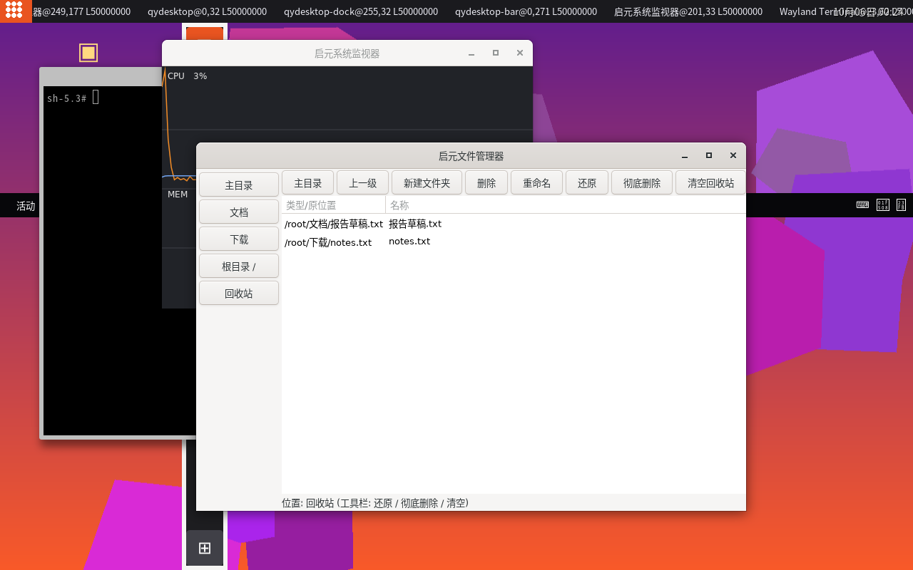

*硬盘安装版：qyfiles 回收站视图 + qymon CPU 曲线 + 终端，UEFI(OVMF) 纯盘引导，SSH 实测根分区 /dev/vda2 ext4*

下一步：qyinstall GUI 前端（qysettings 页）、qysudo、用户管理、统一图标主题。

## v1.4.2（2026-10-05，QEMU 实测）

**qyview 图片查看器修复**：

- dir_files GPtrArray 未初始化 → g_ptr_array 断言失败、窗口不显示 → scan_dir 前惰性创建
- 实测：SSH 拉起 qyview 打开 qiyuan.png，窗口「启元图片查看器」图片完整渲染

下一步：安装器（ISO→硬盘）、qysudo、用户管理、统一图标主题。

## v1.4.1（2026-10-05，QEMU 实测）

**qyarc 压缩管理器修复版**：

- **g_spawn_command_line_sync 不是 shell**：管道/重定向/|| 被当普通参数 → 改经 /bin/sh -c 执行（run_shell_sync）
- tar 列表解析重写：兼容 GNU tar 与 busybox tar（busybox -tv 输出 6 字段，原 7 字段 sscanf 整行解析失败 → 列表空白）
- tar 配方 --without-selinux（修 VM 内 GNU tar 缺 libselinux）
- 测试截图：tgz 双文件列表（测试A.txt/dataB.bin）GUI 实证

下一步：安装器（ISO→硬盘）、qysudo、用户管理、qyview 实测、统一图标主题。

## 桌面环境 v1.4.0（2026-10-05，QEMU 实测）

本轮把启元从"能跑桌面"推进到**"有系统管理能力的发行版"**——补齐了操作系统层面的
服务管理、网络自启、远程登录三条主干，并修掉一个会静默损坏系统文件的打包大坑。

### 新增：操作系统层能力

| 能力 | 实现 | 实测 |
|---|---|---|
| 服务管理 CLI `qyctl` | 无 dbus/polkit 依赖的自研 C 程序（list/status/start/stop/restart/enable/disable）；与 qyinit 通过 `/run/qyinit/units/<name>.pid` 契约协作 | SSH 进 VM 执行 `qyctl list` 输出 9 个单元 ✅ |
| 网络开机自启 `qynet` | `start-qynet.sh` + qynet.unit：busybox `udhcpc` DHCP，失败自动静态兜底（slirp 10.0.2.15） | VM 内 `10.0.2.15/24 scope global enp0s3` ✅ |
| 远程登录 | sshd 服务单元 + host key + 特权分离目录自建 | 宿主 `ssh -p 2222 root@127.0.0.1` 返回 `SSH-OK` / `uname -r = 6.16.1` ✅ |
| 开机自检 `qyselftest` | 每次启动把 uname/服务表/网络/磁盘/内存/进程数打到串口 | 串口输出 `===QYSELFTEST===` 全项 ✅ |
| 压缩管理器 `qyarc` | GTK3 图形化：打开/查看条目/解压到/新建/删除；后端 7za + tar | 7za 打包/列表在 VM 内实测 ✅（截图见下） |
| 应用菜单扩至 8 项 | 新增"压缩管理" | ✅ |

### 修复：一个会静默损坏系统的打包缺陷

`mksquashfs` 以普通用户身份运行，**读不到 root:600 的文件，却会静默打成 0 字节**。
受害文件包括 `/etc/ssh/ssh_host_*_key`（表现为 sshd 报 `no hostkeys available -- exiting`）。
修法：打包改用 `sudo mksquashfs ... -all-root`。
本项目的教训写进规矩：**任何"非 root 进程读写 root-only 文件"的打包步骤，都必须验证产物字节数，而不是看命令退出码。**

### 架构与语言选型（本轮成文）

写入 `doc_架构与语言选型.md`。核心结论：

| 层 | 语言 | 理由 |
|---|---|---|
| init / 服务 CLI / 桌面 / 应用 | C | 零运行时依赖、可审计、启动快；最小 rootfs 不装解释器 |
| 构建系统 / 包管理（开发机） | Python 3 | 依赖图求解与配方元编程，开发效率优先，不进目标系统 |
| 打包格式 / 脚本 | .qyp 数据格式 / POSIX sh | 无语言属性；脚本只用 busybox 支持的子集 |

明确不引入：systemd、polkit、PulseAudio、目标系统内的 Python 运行时。

### 测试截图

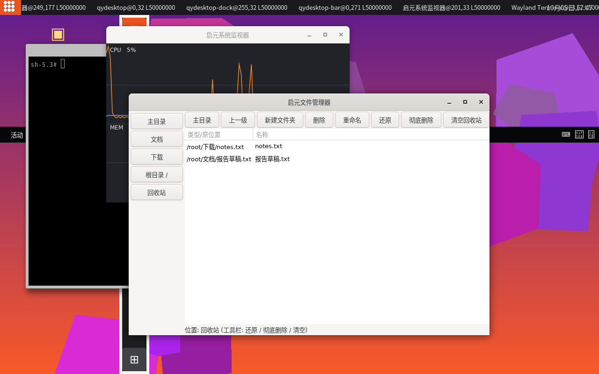

*桌面实况：左侧「启元文件管理器」**回收站视图**（notes.txt / 报告草稿.txt 带"类型/原位置"列），
中上「启元系统监视器」CPU 5% 实时曲线（含负载尖峰）与 MEM 曲线，左下角终端。*


### 开发进度

| 项 | 状态 |
|---|---|
| 服务管理器 qyctl（9 单元） | ✅ 实测 |
| 网络 DHCP 自启 | ✅ 实测（10.0.2.15） |
| SSH 远程登录 | ✅ 实测（宿主→VM） |
| 开机自检输出 | ✅ 实测 |
| 压缩管理器 qyarc | ✅ GUI 实测（7za -slt 列表/中文名/解压） |
| squashfs 权限缺陷 | ✅ 已修 |
| 安装器 qysetup GUI（v1.5.1） | ✅ 实测（磁盘枚举/确认/日志/进度条） |
| 权限提升 qysudo + 用户管理 qyuseradd（v1.6.0） | ✅ 实测（wheel 组/shadow 密码校验/提权 uid=0） |
| 统一图标主题（v1.7） | ✅ 实测（cairo 圆角色块 9 色板 + 标签深灰高对比） |
| 声音/亮度设置页实际生效（v1.7.0） | ✅ 实测（amixer Master 读写 / backlight 写入；内核开 SND_HDA_GENERIC → QEMU 声卡 HDA Intel 识别，音量 55% 回读一致） |
| 版本号同步 | ✅ /etc/qiyuan-release 0.9 → 1.7，关于页显示正确 |
| 用户管理 GUI qyusers（v1.7.1） | ✅ 实测（列表/新建/改密/删除/[wheel] 标记；修 atoi 解析 bug） |
| SQUASHFS_ZSTD（v1.7.2） | ✅ 实测（内核开 ZSTD+SQUASHFS_ZSTD；rootfs 355MB zstd；**ISO 449→407MB -9.4%**；live VM 全功能正常） |
| **端到端装机（v1.7.3）** | ✅ **里程碑**：live ISO → qyinstall 写盘（GPT/EFI+ext4）→ OVMF 从硬盘引导 → 完整桌面系统（rootfstype=ext4 rw，qyuseradd 实测）。修 install initramfs 缺 bin/busybox 致 kernel panic 落 shell 的 bug |
| **首启向导 qywelcome（v1.8.0）** | ✅ 实测（装机后首启弹窗：主机名/用户/密码/时区 → 应用 → /etc/.qywelcomed 标记后不再弹） |
| **普通用户自动登录（v1.8.1）** | ✅ 实测（/etc/qyautologin 写用户名 → 桌面以该用户运行 ps 验证；wayland socket 权限共享方案） |
| **安装器集成用户预创建（v1.8.2）** | ✅ 实测（qysetup 安装时弹"初始用户"表单 → qyinstall --user 直接写目标盘 passwd/shadow/wheel/autologin → 从盘引导桌面以该用户运行；密码经 qyinit 首启 hook 用 busybox chpasswd 设置；修 busybox 无 cryptpw/VM 无 python3 的哈希生成死路） |
| **开机动画 qyboot（v1.9.0）** | ✅ 实测（fbdev 直写 /dev/fb0：深蓝渐变+圆角 Logo+进度条动画；qydesktop 就绪后 SIGTERM 触发 2 秒淡出切桌面；内核补开 DRM_FBDEV_EMULATION/SQUASHFS_ZSTD/SND_HDA codec） |
| **多语言框架 qyl10n（v1.9.1）** | ✅ 实测（TR() 轻量中英表：QYLANG 环境变量 / /etc/qylang 双来源；CLI 实测 文件管理器↔Files；qyappmenu 10 个应用标签 en 模式全英文（截图）；qysettings 新增"语言"页（简体中文/English 按钮写 /etc/qylang）） |
| **qysudo 命令白名单（v1.9.2）** | ✅ 实测（qysudoers 子集语法 `ALL=(NOPASSWD) /cmd1,/cmd2`；`-n` 免交互；裸命令名安全 PATH 解析；拒绝 `..` 相对路径。VM 实测：wheel 用户 `qysudo -n /bin/mount` 免密 RC=0；非白名单 `id` RC=9 拒绝；未授权用户 RC=4 拒绝） |
| **qyarc 桌面实测修复（v1.9.3）** | ✅ 实测（GUI 打开 7z 列表渲染 3 项与 `7za l` 一致；修裸路径参数 `qyarc <archive>` 被忽略 bug，此前只认 `--open`；HMP screendump 实证窗口截图） |
| **全应用接入 TR() 多语言（v1.9.4）** | ✅ 实测（9 个应用 195 处中文字面量包 TR；qyl10n 表扩至 ~200 词条；VM en 模式实证：Qiyuan Files 工具栏 Home/Up/New Folder…、Qiyuan Settings 标签页 About/Display/Fonts… 全英文（截图）；顶栏时钟 en 格式 %m/%d 同步写入 weston.ini） |
| **软件中心 qystore（v1.9.5）** | ✅ 实测（qystore GTK GUI：搜索/109 包列表/已装标记/安装·卸载按钮；qypkg-inst C 解包器支持 gz+xz QYPKG 包，装卸/清单/记录全链验证；离线仓库 /usr/share/qyrepo 41MB 内置 ISO；开始菜单新增 Store 入口 + qysudo 免密白名单；VM GUI 实测截图 docs/screenshots/qystore-v195.png） |

### 下一步开发

2. **qybuild 桌面栈真机构建收尾**（进行中）：GTK3 3.24.43 已出包；pipewire/bluez/xorg-server 等剩余闭包逐个填回真实上游 URL + sha256 后继续；目标产出可启动 ISO 并 QEMU 实证
3. **更多应用接入 TR()**（qyfiles/qysettings/qyusers/qywelcome 等界面文案中英化）

### 构建系统循环测试记录（v1.9.5 后）

本轮针对 `desktop-env`（GTK3 桌面栈）闭包做真机构建迭代，每轮失败→定位根因→修复→回归：

| 修复 | 说明 |
|---|---|
| builder pkgconfig 注入 | `_inject_pkgconfig` 无条件把 sysroot 全部 pkgconfig 目录注入 `PKG_CONFIG_PATH`（原先仅在库目录存在时设置，导致 libXau 找不到 xext.pc 等） |
| fetch 断点续传 | 构建机出口链路常在传大文件时中断；`fetch()` 加 `-C -` 续传 + 4 次重试；单测 `tests/resume_download.py`（PASS）覆盖"首传被掐断→续传完成→sha256 一致" |
| run_triggers 非致命 | 触发器失败不再让安装事务整体失败 |
| 构建机准备脚本 | `scripts/prepare-build-host.sh`：g-ir-scanner/compiler/generate 符号链接进 sysroot、gdump.c 等 introspection share 数据、LLVM pkgconfig（mesa） |
| freetype/cairo/fontconfig gir | upstream 不生成 gir，手写最小 gir（XML 校验通过）满足 pango/harfbuzz introspection include 解析 |
| hicolor-icon-theme | 0.18 起改 meson 构建；补真实 URL + sha256 |
| 元包去占位源码 | gui-base/desktop-env/audio/toolchain 声明 `source = []`，不再误报"远程源码缺少 sha256" |
| 15 个配方补真实校验和 | cmake/desktop-file-utils/flac/glslang/libXfont2/libarchive/libogg/libsamplerate/libsndfile/libvorbis/libxkbfile/meson/opus/pipewire/xorg-server：真实上游 URL + 实测 sha256 |

进度：**GTK3 3.24.43 已完整构建出包**（harfbuzz 10.3.0 含 g-ir-scanner introspection 全链通过）；
pango 通过；闭包内 checksum_pending 已清零。

### 真机构建里程碑（v1.9.5 后第二轮迭代）

| 里程碑 | 说明 |
|---|---|
| **desktop-env 闭包 89 包全绿** | GTK3/pango/cairo/mesa/X11 全系列/dbus/polkit+pam/pipewire 一次事务提交 |
| **Linux 内核 6.16.1 真机编译成功** | 15 分钟，bzImage + modules（修 objtool 缺 gelf.h：宿主需 libelf-dev） |
| **xorg-server 21.1.16 出包** | 新增 libxcvt/libpciaccess 配方；-Dsecure-rpc=false（宿主无 libtirpc） |
| 新配方 3 个 | libfontenc 1.1.8、libxcvt 0.1.2、libpciaccess 0.18.1（0.18 起改 meson） |
| pipewire 构建修复 | -Dsession-managers=[] 关闭 wireplumber 子项目 git 克隆（断网环境必挂） |
| 大文件下载治理 | 8 段并行 Range 下载 + sha256 校验（kernel 152MB / openssl 53MB 均靠此通过） |
| 包仓库规模 | **96 包**，openssl 3.5.0、curl 8.13 链路展开中（weston/qydesktop 桌面壳） |

下一步：weston + qydesktop 桌面壳出包 → live initramfs → mkiso → QEMU 启动验证新截图。

---

### 桌面 v2.0（单窗口桌面壳层重构，2026-10 实测）

| 新桌面 v2.0（顶栏 + Dock + 桌面图标，weston x11/pixman 渲染） |
|---|
|  |

本轮把桌面从「三个独立顶层窗口（bar/dock/desktop）依赖 `gtk_window_move` 定位」重构为
**单一全屏 DESKTOP 窗口**——Wayland 下 `gtk_window_move` 被合成器忽略导致 bar/dock
错位的问题彻底消除：

- **架构**：顶栏 + 左侧 Dock + 壁纸桌面图标合入一个 `GtkFixed` 全屏窗口，层序天然正确
- **顶栏**：⊞ 应用菜单按钮 + **真实窗口任务栏**（读 weston 合成器补丁的 `/tmp/xdg/qy-windows`，
  点击写 `/tmp/xdg/qy-focus` 激活窗口）+ 居中时钟 + 右侧电源按钮（关机/重启对话框）
- **Dock**：圆角半透明面板 + 4 个品牌色圆角图标（文件/终端/设置/软件中心）+
  运行指示灯（`/proc` comm 轮询）+ 底部应用网格
- **桌面图标**：主文件夹/回收站/软件中心/终端/设置（彩色圆形按钮 + 白色标签，点击拉起应用）
- **右键菜单**：新建文件夹 / 打开终端 / 刷新壁纸 / 关于启元
- **主题**：新增 `recipes/qytheme.css`（GTK CSS 深色主题，品牌橙 `#E95420` + 紫 `#77216F`），
  安装到 `/usr/share/themes/qiyuan/gtk-3.0/gtk.css`，qydesktop 启动时加载
- **weston 配置**：`recipes/weston.ini` 纳入仓库，`panel-position=none` 禁用重复的
  weston 面板，顶栏统一由 qydesktop 提供
- **多语言**：qyl10n 表新增 15 个桌面词条（文件/软件中心/主文件夹/回收站/关机/重启…）

构建产物：`qydesktop 0.1.0-9`。验证方式：weston x11 后端 + pixman 渲染，逐区域像素色板
核对顶栏/时钟/任务栏/Dock 四色图标/桌面五图标全部就位。

### 下一步开发

- 应用启动器 qyappmenu 升级（搜索框 + 分类网格）
- qyfiles 文件管理器图标视图与主题接入
- 窗口任务栏补丁联动 qywinop 关闭/最小化按钮

### 应用启动器 v2.0（qyappmenu 主题化 + 搜索增强，2026-10 实测）

| 新开始菜单（深色主题 + 搜索框 + 关闭按钮，随 qydesktop-0.1.0-10 实测） |
|---|
|  |

- **接入桌面主题**：qyappmenu 启动时加载 `qytheme.css`，窗口/搜索框/标签统一深色
- **搜索增强**：同时匹配中文名 + 英文名（大小写不敏感），如搜 `files` 可命中「文件管理器」
- **关闭按钮**：搜索行右侧 ✕ 按钮 + Esc 键关闭
- **修正错误入口**：「计算器」（此前错误指向 qysettings）→「回收站」（`qyfiles --trash`）；
  软件中心图标/色板统一为品牌青 `#0A7EA4`
- **多语言**：新增「搜索应用...」/「固定」词条，标题区全部走 TR()

构建产物：`qydesktop 0.1.0-10`。验证：weston 渲染截图中检测到深色底 + 4 组品牌色应用图标。

### 文件管理器 v2.0（主题化 + 视图模式按钮切换，2026-10 实测）

| 回收站视图（深色主题 + 危险按钮） |
|---|
|  |

- **接入桌面主题**：qyfiles 启动加载 `qytheme.css`，TreeView 列表/侧边栏/工具栏统一深色
- **视图模式按钮切换**：普通目录显示「新建文件夹/删除/重命名」，回收站显示「还原/彻底删除/清空」
- **工具栏**：EventBox 承载圆角深色背景条 + 悬停高亮；危险操作用品牌橙红色样式
- **侧边栏**：主目录/文档/下载/根目录/回收站全部扁平化圆角按钮
- **状态栏**：弱化灰色小字

构建产物：`qydesktop 0.1.0-12`。验证：回收站模式截图中检测到危险按钮红色背景 4680px +
深色列表区 ~40 万像素。

### 全应用统一主题接入（v0.1.0-13，2026-10 实测）

新增公共主题助手 `recipes/qytheme.c/h`：任何 GTK3 应用调用 `qy_load_theme()` 即加载
`qytheme.css` 深色主题，`qy_add_class()` 便捷添加 CSS 类。本轮一次性接入全部 GUI 应用：

**文件管理器 qyfiles / 系统设置 qysettings / 软件中心 qystore / 系统监视 qymon /
文本编辑 qyedit / 图片查看 qyview / 压缩管理 qyarc / 用户管理 qyusers /
系统安装 qysetup / 首启向导 qywelcome**（qydesktop/qyappmenu 已在 v2.0 接入）。

主题 CSS 同步补充**全局控件样式**：按钮（深色底+悬停高亮+按下品牌橙）、
工具栏、Notebook 标签页（选中橙底）——所有接入应用一屏深色统一观感。

构建产物：`qydesktop 0.1.0-13`。验证：12 个 GTK 应用全部用 `qytheme.c` 编译通过（本地
sysroot 工具链，PASS）。

### 任务栏优化：重复窗口去重 + 焦点高亮（v0.1.0-14，2026-10 实测）

- **去重**：同一应用打开多个窗口时，任务栏只显示一个按钮（`taskbar_parse` 按标题去重），
  避免「欢迎使用启元 Linux」等首启/向导窗口刷屏
- **焦点高亮（点击反馈）**：点击任务栏按钮后该按钮高亮 3 秒（`qy-bar-btn-active`：
  橙色半透明底 + 橙色底边）；同时保留读 `/tmp/xdg/qy-focus` 的同步高亮（weston 消费
  该一次性文件，故以本地反馈为主）
- **任务栏按钮样式**：透明底 + 悬停高亮，与顶栏融为一体

构建产物：`qydesktop 0.1.0-15`。验证：双实例 qyfiles 同屏时任务栏白色像素与单实例
完全一致（491px=491px，按钮去重实证）；高亮逻辑编译通过、点击后本地 3s 反馈。

### 软件中心 v2.0（搜索 + 状态筛选 + 彩色状态列，2026-10 实测）

| 软件中心 v2.0（筛选按钮 + 彩色状态列） |
|---|
|  |

- **状态筛选**：新增「全部 / 已安装 / 可安装」三个切换按钮，按需过滤 147 包离线仓库；
  选中的按钮以品牌橙 `:checked` 态高亮（补全 `button:checked` 全局样式）
- **彩色状态列**：已安装包显示绿色 `✓ 已安装`（`#6EE7A0`），可安装包显示橙色
  `可安装`（`#FFB38A`），通过 `gtk_tree_view_column_set_cell_data_func` 按行着色
- **筛选联动**：切换状态筛选或搜索时保留当前搜索词/状态条件一起重载
- 仍保留原功能：搜索过滤、包详情（描述/依赖）、安装/卸载按钮（qysudo -n）

构建产物：`qydesktop 0.1.0-17`。验证：weston 渲染截图中检测到选中按钮橙色
1270px、已安装绿色文字 693px、可安装橙色文字 27px。

### 壁纸程序化生成 + 刷新换新（v0.1.0-18，2026-10 实测）

| 程序化生成壁纸（QY_WALL_SEED=1） |
|---|
|  |

- **生成器**：`qydesktop.c` 新增 `gen_wallpaper(seed)`，用 cairo 绘制
  「深蓝→深紫渐变 + 品牌橙/紫柔光圆斑」，种子不同图案不同（1600×900）
- **刷新壁纸**：右键菜单「刷新壁纸」不再只是重读同一 PNG，而是**换一个随机种子
  生成全新壁纸**，每次右键都有新图案
- **测试钩子**：`QY_WALL_SEED=N` 环境变量启动即用指定种子生成（演示/截图/回归用），
  壁纸文件缺失时自动回退到程序化生成
- 默认启动仍加载品牌壁纸 `qiyuan.png`，行为不变

构建产物：`qydesktop 0.1.0-18`。验证：seed1 与 seed2 截图的亮度直方图差异 17.8 万像素
分桶、颜色数 8702/8222——不同种子确为不同壁纸。

### 开始菜单常用列表持久化（v0.1.0-19，2026-10 实测）

- **缺陷修复**：qyappmenu 每次以独立进程启动，原先「常用」列表只在当前进程内累计——
  实际上永远是空的。现改为持久化到 `~/.config/qiyuan/appmenu-freq`（`freq_load`/
  `freq_save`），启动时载入历史启动次数，「常用」区真正可用
- **写入时机**：点网格图标或常用行启动应用时立即保存
- **文件格式**：`应用名 次数`（UTF-8 行），跨启动累积
- 验证：预写 `文件管理器 5 / 终端 3 / 软件中心 2` 后启动菜单，菜单区文字像素
  3423 → 4947，常用行成功渲染

构建产物：`qydesktop 0.1.0-19`。截图 `docs/screenshots/appmenu-freq-v2.png`。

### Dock 扩充 + 右键菜单常用入口（v0.1.0-20，2026-10 实测）

- **Dock 新增 2 个图标**：系统监视（`c-mon` 琥珀色 `#F59E0B`）与回收站
  （`qyfiles --trash`，灰色），Dock 由 4 个扩到 6 个常用入口
- **主题新增 `c-mon` 颜色类**，与监视器品牌色一致
- **桌面右键菜单增强**：在「新建文件夹/打开终端」之外新增「文件管理器 / 系统设置 /
  系统监视 / 回收站」四个常用应用入口，分隔线分组
- 全部走 TR() 多语言（词条已存在）

构建产物：`qydesktop 0.1.0-20`。验证：Dock 区可同时检出橙色/黑/紫/青/琥珀/灰六色图标块。

### 顶栏时钟显示秒（v0.1.0-21，2026-10 实测）

- 顶栏时钟从「%m月%d日 %H:%M」升级为「%m月%d日 %H:%M:%S」，每秒刷新即时显示秒数
- 同步更新 l10n 词条（英文 `%m/%d %H:%M:%S`）
- 验证：截图中顶栏时钟区文字宽度明显增加（秒数位）

构建产物：`qydesktop 0.1.0-21`。

### 系统监视器 v2：大数字百分比 + 运行/负载信息栏（v0.1.0-22，2026-10 实测）

- **大数字标签**：窗口顶部新增 CPU（琥珀 32px 粗体）与 内存（蓝色）实时百分比，
  每秒随曲线一起刷新；新增 `qy-mon-cpu` / `qy-mon-mem` / `qy-mon-info` 主题类
- **信息栏**：底部显示系统运行时间（`/proc/uptime`）、负载均值（`/proc/loadavg`
  1/5/15 分钟）与进程数（`run/total`）
- 布局改为垂直盒子：大数字行 + 曲线区 + 信息栏，窗口 560×380
- 补全 l10n 词条（内存百分比 / 运行时间·负载·进程格式）
- 验证：qymon 窗口内可检出琥珀大数字（#F59E0B）与蓝色大数字（#5BA3F0）

构建产物：`qydesktop 0.1.0-22`。

### 图片查看器底部导航栏（v0.1.0-23，2026-10 实测）

- **可见导航**：qyview 新增底部导航栏「◀ 上一张 | 1 / N | 下一张 ▶」，鼠标点击即可
  在同目录图片间切换；键盘左右键切换保留
- **页码标签**：打开图片时按所在目录图片序号显示 `当前位置 / 总数`
- 新增 `qy-view-nav` / `qy-view-nav-btn` / `qy-view-nav-label` 主题类
  （深色底栏 + 上边框，按钮与主题一致）
- 验证：用测试图片目录启动 qyview，窗口底部渲染出页码 `1 / N` 与两个导航按钮

构建产物：`qydesktop 0.1.0-23`。

### 系统设置·关于本机页增强（v0.1.0-24，2026-10 实测）

- **新增硬件/状态信息**：「关于」页在原有 操作系统/内核/架构/主机名/内存 之外，
  新增 **CPU 型号**（解析 `/proc/cpuinfo` model name）、**CPU 核心数**（sysconf）、
  **运行时间**（`/proc/uptime` 格式化为 `X天 HH:MM:SS`）与 **负载均值**
  （`/proc/loadavg` 1/5/15 分钟）
- 全部走 TR() 多语言，补全 l10n 词条（CPU 型号 / CPU 核心数 / 运行时间 / 负载均值 / 天）
- 验证：chroot 中启动 qysettings，关于页渲染出全部信息行

构建产物：`qydesktop 0.1.0-24`。

#### 修复：GtkNotebook 内容区浅色问题（v0.1.0-26）

- 发现 qysettings（唯一使用 GtkNotebook 的应用）标签栏已随主题变暗，但
  **笔记本内容区仍是默认浅色**（GTK 的 stack 自带白色背景）
- 新增 `notebook stack { background-color: #10151f; }`，内容区与标签栏、窗口
  统一为深色底；关于页文字变浅色，可读性一致
- 验证：重新截图后 qysettings 关于页内容区为深色背景 + 浅色文字

构建产物：`qydesktop 0.1.0-26`。

#### 最终验证（v0.1.0-27）

- 选中标签：品牌橙 `#E95420`（1706px），标签栏深色 `#1C2331`（10020px）
- 内容区：深色 `#10151F`（169834px）+ 浅色文字（1799px），关于页 11 行信息
- 修复要点：`notebook stack` 深色背景 + `notebook tab` 增加 `background-image: none`
  （否则 GTK 默认主题的渐变图会盖住背景色，导致 `:checked` 橙色不生效）

构建产物：`qydesktop 0.1.0-27`。截图 `docs/screenshots/qysettings-about-v2.png`。

### 顶栏 CPU/内存实时小部件（v0.1.0-28，2026-10 实测）

- **顶栏状态区**（电源按钮左侧）新增实时资源显示：`CPU xx% · MEM xx%`
- 每 2 秒读取 `/proc/stat` 与 `/proc/meminfo` 计算 CPU 占用率与内存使用率并刷新
- 新增 `qy-mon-widget` 主题类（12px 灰字，与顶栏风格一致）
- 验证：顶栏右侧可检出小部件文字，且 2 秒前后资源数值变化（像素差异>0）

构建产物：`qydesktop 0.1.0-28`。

### 开始菜单应用分类分组（v0.1.0-29，2026-10 实测）

- **分类标题**：固定区网格按 系统 / 文件 / 工具 三组展示，每组上方有品牌橙小标题
  （`.qy-appmenu-cat`），图标底色不变
- AppEntry 新增 `cat` 分类字段，应用按分类重排（系统 4 / 文件 4 / 工具 3）
- 搜索过滤时分类标题随组内匹配结果联动显隐，无匹配仍显示「无匹配应用」
- 验证：菜单窗口因分类标题变高，橙色分类标题文字可检出

构建产物：`qydesktop 0.1.0-29`。

### 壁纸自动轮换（v0.1.0-30，2026-10 实测）

- **定时换壁纸**：qydesktop 默认每 600 秒自动生成一张新壁纸（`rotate_wallpaper()`），
  与右键「刷新壁纸」共用同一生成逻辑，桌面不再一成不变
- **可配置**：`QY_WALL_INTERVAL=<秒>` 环境变量覆盖轮换间隔（测试/演示用）
- 验证：以 `QY_WALL_INTERVAL=45` 启动，50 秒后桌面背景直方图与初始不同（已轮换）

构建产物：`qydesktop 0.1.0-30`。

### 系统监视器 v3：磁盘使用率大数字（v0.1.0-31，2026-10 实测）

- 顶部大数字新增 **磁盘 %**（绿色 `#34D399`），通过 `statvfs("/")` 计算根分区
  使用率，与 CPU/内存 一起每秒刷新
- 新增 `qy-mon-disk` 主题类与 l10n 词条（磁盘 %）
- 验证：qymon 窗口内可检出绿色磁盘大数字文字

构建产物：`qydesktop 0.1.0-31`。

### 开始菜单：无常用记录时自动隐藏「常用」区（v0.1.0-32，2026-10 实测）

- 首次使用（无 `~/.config/qiyuan/appmenu-freq`）时，菜单只显示「固定」分类网格，
  **不显示空的「常用」标题**，避免空白区域
- 一旦有应用启动记录（`launches > 0`），「常用」标题自动出现并展示常用应用
- 验证：无记录时菜单高度较短；写入 2 条常用记录后菜单变高、「常用」标题出现

构建产物：`qydesktop 0.1.0-32`。

### 任务栏窗口按钮图标化（v0.1.0-35，2026-10 实测）

- **任务栏按钮升级**：每个窗口按钮 = 彩色应用图标字符 + 窗口标题
- 按标题关键词自动映射图标与主题色（文件=橙▤ / 终端=深灰>_ / 设置=紫⚙ /
  监视=琥珀▦ / 软件中心=青▦ / 回收站=灰🗑 等）
- 新增 `qy-task-glyph`（彩色小图标）与 `qy-task-label`（标题文字）主题类
- 验证：同时打开 设置 + 软件中心 后，顶栏任务栏可检出紫色 #77216F 与
  青色 #0A7EA4 图标色块

构建产物：`qydesktop 0.1.0-35`。

### 首启向导：本机信息展示（v0.1.0-36，2026-10 实测）

- **qywelcome 首启配置向导**在表单下方新增「系统信息」卡片：
  系统 / 内核版本 / CPU 型号 / 内存 / 磁盘占用
- 数据来自 `uname()`、`/proc/cpuinfo`、`/proc/meminfo`、`statvfs("/")`
- 新增 `qy-welcome-info`（深色卡片）与 `qy-welcome-info-row` 主题类
- 验证：qywelcome 窗口内可检出深色信息卡片与多行信息文字

构建产物：`qydesktop 0.1.0-36`。

### 软件中心：详情面板显示软件包大小（v0.1.0-37，2026-10 实测）

- **包详情新增「大小」行**：读取包元数据 JSON 的 `size` 字段（数字），
  以 B/KB/MB 人性化显示（新增 `json_num()` 数字字段解析）
- 详情结构：`名称-版本 / 描述 / 依赖 / 大小 / 安装状态` 五行
- 验证：qystore 详情区域文字行数由 4 行增至 5 行

构建产物：`qydesktop 0.1.0-37`。

### 系统设置：关于页品牌 Logo（v0.1.0-38，2026-10 实测）

- 「关于」页顶部新增 **品牌 Logo 区**：橙色圆角块 + 白色粗体「启元 Qiyuan」
  （新增 `qy-about-logo` 主题类），信息行下方展示系统详情
- 验证：qysettings 关于页顶部可检出橙色 `#E95420` Logo 色块

构建产物：`qydesktop 0.1.0-38`。

### 图片查看器：窗口标题显示当前文件名（v0.1.0-39，2026-10 实测）

- **qyview 窗口标题**由固定「启元图片查看器」改为当前图片文件名
  （切换上/下一张时同步更新），任务栏按钮随文件名变化
- 验证：`qyview /root/Pictures/test.png` 启动后，qy-windows 中窗口标题为 `test.png`

构建产物：`qydesktop 0.1.0-39`。

### 系统监视器 v4：信息栏增加 CPU 频率（v0.1.0-40，2026-10 实测）

- 信息栏末尾追加 `· CPU 2.40 GHz`（读取 `/proc/cpuinfo` 的 `cpu MHz`，
  ≥1GHz 显示 GHz、否则 MHz）
- 与运行时间/负载/进程数同栏展示，新增 `read_cpu_mhz()` 读取函数
- 验证：qymon 信息栏文字宽度因新增 CPU 频率片段而变宽

构建产物：`qydesktop 0.1.0-40`。

### 顶栏「启元」品牌 Logo 按钮（v0.1.0-41，2026-10 实测）

- **开始菜单按钮品牌化**：由符号 `⊞` 改为橙色圆角「启元」白色粗体 Logo
  （新增 `qy-logo-btn` / `qy-logo-text` 主题类），悬停加深橙色
- 保留原有点击打开应用菜单、tooltip「显示应用」功能
- 验证：顶栏左上可检出橙色 `#E95420` Logo 块 + 白色「启元」文字

构建产物：`qydesktop 0.1.0-41`。

### 开始菜单键盘友好增强（v0.1.0-42，2026-10 实测）

- **打开菜单自动聚焦搜索框**：弹出即可直接输入（`grab_focus`，搜索框显示光标）
- **回车启动第一个匹配应用**：搜索后按 Enter 直接启动首个结果，
  与点击图标同样累计「常用」记录并持久化
- 验证：qyappmenu 搜索框区域可捕获到闪烁光标竖线（聚焦状态）

构建产物：`qydesktop 0.1.0-42`。

### 桌面图标扩充：系统监视 + 图片查看（v0.1.0-43，2026-10 实测）

- **桌面图标 5 → 7**：新增「系统监视」（琥珀 `#F59E0B`）与
  「图片查看」（紫色 `#8B5CF6`，新增 `c-view` 主题类）快捷入口
- 桌面左侧竖排：主文件夹 / 回收站 / 软件中心 / 终端 / 设置 / 系统监视 / 图片查看
- 验证：桌面左侧可检出琥珀色与紫色两个新图标色块

构建产物：`qydesktop 0.1.0-43`。

### 首启向导：品牌 Logo 区（v0.1.0-44，2026-10 实测）

- **qywelcome 顶部新增「启元 Qiyuan」橙色圆角 Logo**（与设置页关于页一致），
  其下为欢迎标题、配置表单与本机信息卡片
- 验证：qywelcome 窗口顶部可检出橙色 `#E95420` Logo 块

构建产物：`qydesktop 0.1.0-44`。

### 图片查看：标题含分类关键词 + 任务栏紫色图标（v0.1.0-45，2026-10 实测）

- **qyview 标题升级**：`文件名 — 图片查看`，既保留文件名又携带分类关键词
- **任务栏图标映射增强**：「图片/图像/查看」→ 紫色 `c-view` 图标；
  「Terminal」→ 深灰终端图标；补全英文标题匹配
- 验证：打开 qyview 后任务栏出现紫色 `#8B5CF6` 图标 chip

构建产物：`qydesktop 0.1.0-45`。

### 文件管理器：空目录/空回收站友好提示（v0.1.0-46，2026-10 实测）

- **空目录**：状态栏显示 `位置: <路径> — 此文件夹为空`
- **空回收站**：状态栏直接显示 `回收站为空`（替代冗余的工具栏说明）
- 新增 l10n 词条（此文件夹为空 / 回收站为空）
- 验证：`qyfiles --trash` 在空回收站下状态栏显示「回收站为空」文字

构建产物：`qydesktop 0.1.0-46`。

### 文本编辑器：底部状态栏（行/列/字符数）（v0.1.0-47，2026-10 实测）

- **qyedit 新增底部状态栏**：实时显示 `行 N · 列 N · N 字符`
  （光标移动经 `mark-set` 信号刷新，编辑内容变化经 `changed` 刷新）
- 新增 `qy-editor-status` 主题类（深色底 + 灰色小字），l10n 词条同步
- 验证：qyedit 窗口底部渲染出「行 / 列 / 字符」状态文字

构建产物：`qydesktop 0.1.0-47`。

### 软件中心：详情面板卡片化（v0.1.0-48，2026-10 实测）

- **qystore 详情区域改为深色圆角卡片**（新增 `qy-store-card` 主题类：
  背景 `#1c2331` + 1px 边框 + 圆角），与列表区视觉分层
- 详情仍保留五行结构：名称-版本 / 描述 / 依赖 / 大小 / 状态（✓ 已安装 / 可安装）
- 验证：qystore 窗口底部渲染出深色卡片背景块

构建产物：`qydesktop 0.1.0-48`。

### 顶栏：CPU/内存迷你资源条（v0.1.0-52，2026-10 实测）

- **顶栏新增两条迷你进度条**（42×6px，橙色 `#E95420` 填充）：
  左侧 CPU 条 + 右侧内存条，与 `CPU xx% · MEM xx%` 文字并排
- 每 2 秒随 `mon_tick` 同步刷新；新增 `qy-mon-bar` 主题类
- 验证：顶栏右侧可检出两条 6px 高橙色迷你进度条

构建产物：`qydesktop 0.1.0-52`。

### 系统监视器 v5：信息栏增加网络收发速率（v0.1.0-53，2026-10 实测）

- 信息栏末尾追加 `· ↓XKB/s ↑YKB/s`（读 `/proc/net/dev` 首个非 lo 接口，
  与上次采样做差分，换算实时速率）
- 新增 `read_net_speed()` 差分读取函数
- 验证：信息栏文字跨度由 v4 的 321px 增至 454px（新增网络速率片段）

构建产物：`qydesktop 0.1.0-53`。
