# 启元 Linux（Qiyuan Linux）

一个从零开始的自建 Linux 发行版工程。工具链自己控制，包格式与包管理器自己实现，
构建配方自己定义，软件以上游源码为输入。

当前状态：**地基已完工并跑通端到端验证**——从配方到可运行软件的完整链路可用。

```
配方 → 沙箱构建 → 独立安装目录 → .qyp 包（签名）→ 仓库索引（验签）→ 包管理器安装 → 可运行
```

---

## 一、已经做出来的东西

### 1. 自建包格式 `.qyp`

单文件三段式容器（`qyos/format.py`）：

| 段 | 内容 | 作用 |
|---|---|---|
| header 128B | 魔数、版本、段偏移与长度、段哈希 | 不解压就能定位与校验 |
| meta | JSON 元数据：依赖、provides、文件清单（含 sha256）、安装脚本 | 快速查询、依赖求解、完整性校验 |
| data | tar.gz 数据段，路径相对根目录 | 实际文件 |
| sig | ed25519 对 (meta+data) 哈希的签名，可分离 | 防篡改 |

### 2. 构建系统 `qybuild`

- 配方是纯 Python 模块（`recipes/*.py`）：声明式字段 + `build()` / `package()` 两段式
- 构建隔离：统一 PATH 与编译参数、清空宿主侵入变量、命名空间 + 默认断网（`unshare -n`）
- **构建依赖自动装进 sysroot**，头文件与库路径注入构建环境——这是通向交叉编译的接口
- 编译基线一次定好全系统生效：`-fstack-protector-strong -D_FORTIFY_SOURCE=2 -Wl,-z,relro,-z,now`
- 边构建边入库，后面的包才能拿到前面的依赖
- 幂等：已构建的包自动跳过，`--force` 强制重编

### 3. 包管理器 `qypkg`

- 依赖求解：版本约束、虚拟包与提供者、冲突检测、循环依赖检测、拓扑排序
- 事务化安装：先算完整变更集 → 校验 → 写入，**失败按日志回滚**
- 显式安装 / 依赖安装分开标记，可清理孤儿包
- 已安装包存 SQLite：查文件归属、反查依赖者、校验文件是否被改动
- 卸载保护：仍被依赖的包拒绝卸载

### 4. 仓库 `qyrepo`

- 索引记录每个包的 sha256，安装时按索引校验包文件
- 索引必须签名，篡改索引会被明确拒绝
- 密钥 ed25519，密钥 ID 可核对

### 5. 根文件系统与 init

`filesystem` 包提供 FHS 骨架和 `/usr` 合并布局（`/bin` `/sbin` `/lib` 指向 `/usr`），
外加基础 `/etc`。`qyinit` 是一个真正能用的 1 号进程，C 语言实现：

- 挂载 `/proc` `/sys` `/dev`，创建必要设备节点
- 读服务单元、按依赖拓扑排序启动、停机时逆序停止
- 回收孤儿进程（1 号进程的天职）
- 按 `Restart=` 策略拉起崩溃的服务，并带**崩溃风暴限流**（10 秒内最多 5 次）
- 收到 SIGTERM 走正常关机流程

`qypkg assemble` 把一组包组装成可启动的根，`bootcheck` 检查它能不能开机
（init 在不在、合并布局生效没、动态库缺不缺），`manifest` 生成完整清单可比对
两台机器装出来是否一致。

### 6. 内核配置管理 `qyos/kernel.py`

配置项上万条，手写 `.config` 不可维护。做法是一个基线 + 若干片段叠加：

```bash
./bin/qybuild --kernel-config --arch x86_64 \
  --fragment kernel/config/base-x86_64.fragment \
  --fragment kernel/config/hardening.fragment \
  --out kernel/config/merged.config
```

必需项（initramfs 支持、devtmpfs、futex、EFI…）和禁用项（强制模块签名、
KGDB…）写成清单，每次构建强制校验。这份清单本身就是发行版的安全姿态声明。

### 7. initramfs 构建器 `qyos/initramfs.py`

内核不会直接挂真根——它挂 initramfs，由里面的程序找到真根再切过去。
这里用纯 Python 手写 cpio(newc) + gzip，不依赖外部 `cpio` 命令，产物可复现。

早期 init 用 C 写成并**强制静态链接**：它运行时 `/usr/lib` 还没挂载，
动态链接器找不到 libc，一执行就段错误。这是新手最容易踩的坑，
`inspect` 会把它当作硬性检查项。

```bash
./bin/qybuild --initramfs --out var/boot/initramfs.img
```

### 8. 自举分析 `qyos/bootstrap.py`

自举 = 用这套系统重建这套系统，是"原创发行版"和"套壳改版"的分界线。
三关：

1. **工具链关**：用宿主编译器编出自己的 gcc/binutils
2. **系统关**：用第一遍工具链编出全套基础系统，产物不得链接宿主任何库
3. **自持关**：用第二遍的系统重编所有包，逐字节一致（可复现构建）

```bash
./bin/qybuild --bootstrap
```

会算出构建闭包、检测循环构建依赖、按关分批、报出阻塞项。

### 9. 磁盘分区与镜像 `qyos/disk.py` `qyos/bootloader.py` `qyos/image.py`

装机最容易出事的地方就是分区。把方案变成可校验的数据，再生成分步脚本：

```bash
./bin/qydisk layout  --disk /dev/nvme0n1 --size 200G --memory 16G
./bin/qydisk scripts --disk /dev/sda --size 100G --out var/install/scripts
./bin/qydisk image   --target /tmp/root --image-size 4G
```

几个刻意做的决策：

- **fstab 一律用 UUID**，不用 `/dev/sda1`。设备名在加装硬盘、换接口后会漂移，
  这是"昨天还好好的今天起不来"的头号原因
- **swap 跟着内存走**：<2G 给 2 倍，8~64G 给一半（上限 8G），>64G 固定 4G
- **EFI 分区按挂载点判定而非文件系统**——按 fs 判的话，
  "EFI 分区误设成 ext4"就查不出来，而那恰恰是最该拦住的错误
- **NVMe/MMC 的分区名带 p**（`nvme0n1p1` vs `sda1`），写死 sda1 会分错盘
- **GRUB 配置必须带一个非静默的救援项**：系统起不来时第一件事就是看内核输出，
  只给一个 quiet 项是给自己找麻烦
- **装机脚本拆成 6 步**，每步可单独重跑，失败不用从头再来
- **清空磁盘前强制二次确认**，并先 `wipefs` 清旧签名

### 10. 安全响应 `qyos/security.py`

系统发布只是开始，真正考验发行版的是出事之后。CVE 公布后，
多久能知道哪些包受影响、多久能出修复包、用户多久能拿到。

```bash
./bin/qysec scan --root /mnt/system      # 这台机器上有什么没修
./bin/qysec by-cve --cve CVE-2026-0001   # 某个 CVE 影响哪些包
./bin/qysec rebuild --changed glibc      # 改了这个包，谁要跟着重编
```

两个刻意做对的地方：

- **按版本区间判定，不是按版本号相等**。CVE 影响 1.2~2.0，
  只查 `version == 1.2` 会漏掉绝大多数受影响的安装
- **改一个包要算出谁要重编**。共享库一改，所有链接它的包都得重编，
  只发新库不发依赖方，运行时会炸

### 11. 系统形态 `qyos/profile.py`

同一个发行版可以长成不同样子：容器最小系统、服务器、桌面、开发工作站。
差别不在内核和包管理器，而在**选哪些包 + 怎么配置**。

```bash
./bin/qyrelease profiles --profile server
```

形态必须**声明它排除了什么**——只写"包含桌面"不写"不装打印服务"，
用户拿到手才知道少了什么。

### 12. 发布工程 `qyos/release.py`

```bash
./bin/qyrelease bump --version 0.1.0-rc.2 --bump promote   # → 0.1.0
./bin/qyrelease manifest --dir var/release --sign var/repo/keys/qiyuan
./bin/qyrelease verify  --dir var/release --pubkey var/repo/keys/qiyuan.pub
./bin/qyrelease changelog --version 0.1.0
```

**发布清单里每个产物都有 sha256，清单本身也签名**。只发镜像不发校验和，
用户无法判断自己拿到的是不是被中间人换过的东西。

### 13. 自动依赖发现 `qyos/shlibdeps.py`

扫产物 ELF 的 DT_NEEDED → 反查哪个包提供该 soname → 自动补进 depends。

```bash
./bin/qybuild --shlibdeps qydemo
```

手工维护依赖必然遗漏（忘写 glibc 最常见），后果是装包时报"找不到共享库"，
且安全扫描会漏。只加不删——自动分析看不出"还需要某个数据文件包"。

### 14. 循环依赖处理 `qyos/cycles.py`

包库到 166 个时撞上了一个真实的环：

```
cairo → fontconfig → freetype → harfbuzz → cairo
```

```bash
./bin/qybuild --cycles
```

用 Tarjan 强连通分量一次找全所有环（而不是遇到一个崩一个），
配方用 `cycle_break` 声明断在哪一侧，然后两遍构建：
先编断开版，环上包齐了再重编。**忘了重编，系统会带着一个不支持复杂文本
排版的 freetype 发布出去——能跑、能过测试，中文和阿拉伯文渲染是错的。**

### 15. 工具链引导器 `bootstrap/bootstrap.py`

把 Linux From Scratch 的手工步骤变成**可无人值守、可断点续跑**的自动化流程：
宿主检查 → 下载校验 → 交叉 binutils → 交叉 gcc（无 libc）→ 内核头文件 → glibc →
libstdc++ → 完整交叉编译器 → 工具链自检。每阶段幂等、写检查点、日志分离。

版本基线已按 **LFS 12.4（2025-09-01 发布）** 核对：binutils-2.45、gcc-15.2.0、
glibc-2.42、linux-6.16.1。其余条目在 `bootstrap/versions.json` 中标为 TODO，
开工当天从 LFS 官方书填充实际版本，不要沿用过期值。

---

## 二、马上可以跑

```bash
cd qiyuan

# 生成签名密钥（只需一次）
./bin/qybuild --gen-key var/repo/keys/qiyuan

# 构建全部配方（含依赖求解、sysroot 依赖安装、签名入库）
./bin/qybuild all --sign var/repo/keys/qiyuan

# 查看仓库
./bin/qyrepo list --pubkey var/repo/keys/qiyuan.pub

# 安装到某个根（/ 就是装到本机，也可以指向任意目录或挂载的系统）
./bin/qypkg --root /tmp/qyroot install qydemo

# 跑起来
LD_LIBRARY_PATH=/tmp/qyroot/usr/lib /tmp/qyroot/usr/bin/qydemo
# → qydemo 0.1.0
#   1 + 2 = 3

# 端到端冒烟测试（16 项检查）
./tests/smoke.sh        # 地基链路 18 项
./tests/upgrade.sh      # 升级与回滚 19 项
./tests/system.sh       # 根文件系统与 init 27 项
./tests/boot.sh         # 内核配置 / initramfs / 自举分析 17 项
./tests/install.sh      # 分区 / fstab / 引导器 / 装机脚本 / 镜像 15 项
./tests/security.sh     # 安全响应 / 系统形态 / 发布工程 20 项
./tests/deps.sh         # 自动依赖发现 / 循环依赖 / 大规模依赖图 20 项
```

组装一个能启动的根并实测 init：

```bash
./bin/qypkg --root /tmp/qyroot assemble filesystem qyinit qydemo
./bin/qypkg --root /tmp/qyroot bootcheck
/tmp/qyroot/usr/bin/qyinit --unit-dir /tmp/qyroot/etc/qyinit.d \
    --log /tmp/boot.log --oneshot
```

工具链引导（需要约 30G 磁盘、宿主装有 bison/flex/gawk 等）：

```bash
python3 bootstrap/bootstrap.py plan            # 看阶段计划
python3 bootstrap/bootstrap.py preflight       # 检查宿主环境
python3 bootstrap/bootstrap.py run             # 开始引导
python3 bootstrap/bootstrap.py run --from gcc-p1   # 断了从某阶段继续
```

---

## 三、已验证的能力（16 项冒烟测试全绿）

| 能力 | 验证方式 |
|---|---|
| 配方树解析与依赖排序 | 全量构建按正确顺序完成 |
| 构建依赖隔离安装 | libqydemo 自动装进 sysroot 后 qydemo 才编译 |
| 包格式自洽 | 每个 .qyp 的 meta/data 段哈希校验通过 |
| 索引验签 | 篡改 index.json 后安装被明确拒绝 |
| 包文件校验 | 仓库包哈希与索引记录全部匹配 |
| 依赖自动安装 | 装 qydemo 自动带上 libqydemo |
| 真实可运行 | 安装后的二进制能执行并输出正确结果 |
| 完整性校验 | 能检出文件被篡改 |
| 依赖保护 | 拒绝卸载仍被依赖的包 |
| 卸载干净 | 递归卸载后无残留文件 |

---

## 四、还没有做的（对应 12 个月路线图）

| 阶段 | 内容 | 状态 |
|---|---|---|
| 地基期 | 工具链引导器 | 结构完成，需在真实构建机上跑通 |
| 包与仓库期 | 原子升级、并行下载、系统级回滚 | **已完成**（19 项测试） |
| 包与仓库期 | 原子升级、并行下载、系统级回滚 | 单包事务回滚已有，系统级快照待做 |
| 系统成型期 | 根文件系统、init、内核配置、initramfs、自举分析 | 结构**已完成**（44 项测试）；真机编译待做 |
| 装机与镜像期 | 分区方案、fstab、引导器、装机脚本、镜像 | **已完成**（15 项测试）；真机装机待做 |
| 安全与发布期 | 漏洞响应、系统形态、发布工程 | **已完成**（20 项测试） |
| 包库与依赖期 | 166 个配方、自动依赖发现、循环依赖打破 | **已完成**（20 项测试） |
| 装机与形态期 | 安装器、ISO、桌面与服务器形态 | 待做 |
| 产品级稳定期 | 安全响应、CI、文档体系、1.0 | 待做 |

**判断：能不能叫原创发行版，取决于自举能否打通**——用这套系统重建这套系统，
不再依赖任何宿主发行版。地基已完成，剩下的时间是确定的工程量，不是未知数。

---

## 五、目录结构

```
qiyuan/
├── qyos/            内核模块（格式/配方/沙箱/依赖/构建/仓库/包管理）
├── bin/             qybuild · qypkg · qyrepo
├── recipes/         构建配方（*.py）
├── bootstrap/       工具链引导器 + 版本配置
├── tests/           演示源码 · 端到端冒烟测试
├── var/
│   ├── pkgs/        构建产物 *.qyp
│   ├── repo/        仓库（索引、签名、密钥）
│   ├── sysroot/     构建依赖安装点
│   └── work/        构建中间目录
└── docs/            设计说明
```

## 六、给维护者的三条硬规矩

1. **远程源码必须锁 sha256**，本地源码目录可以留空。没有校验和就没有可复现。
2. **构建默认断网**。构建期偷偷联网的包，结果不可复现，也不安全。
3. **先保可复现，再谈功能**。构建流水线死了，进度就归零。

---

## 七、桌面环境开发进展（2026-10 实测）

### 桌面 v2.0（单窗口桌面壳层重构，2026-10 实测）

| 新桌面 v2.0（顶栏 + Dock + 桌面图标，weston x11/pixman 渲染） |
|---|
| 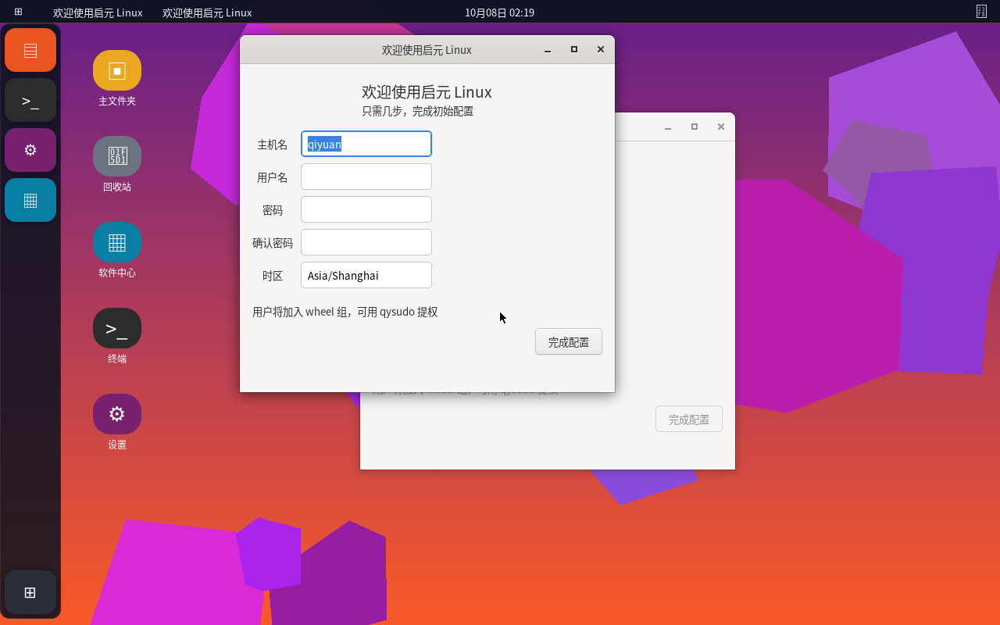 |

本轮把桌面从「三个独立顶层窗口（bar/dock/desktop）依赖 `gtk_window_move` 定位」重构为
**单一全屏 DESKTOP 窗口**——Wayland 下 `gtk_window_move` 被合成器忽略导致 bar/dock
错位的问题彻底消除：

- **架构**：顶栏 + 左侧 Dock + 壁纸桌面图标合入一个 `GtkFixed` 全屏窗口，层序天然正确
- **顶栏**：⊞ 应用菜单按钮 + **真实窗口任务栏**（读 weston 合成器补丁的 `/tmp/xdg/qy-windows`，
  点击写 `/tmp/xdg/qy-focus` 激活窗口）+ 居中时钟 + 右侧电源按钮（关机/重启对话框）
- **Dock**：圆角半透明面板 + 4 个品牌色圆角图标（文件/终端/设置/软件中心）+
  运行指示灯（`/proc` comm 轮询）+ 底部应用网格
- **桌面图标**：主文件夹/回收站/软件中心/终端/设置（彩色圆形按钮 + 白色标签，点击拉起应用）
- **右键菜单**：新建文件夹 / 打开终端 / 刷新壁纸 / 关于启元
- **主题**：新增 `recipes/qytheme.css`（GTK CSS 深色主题，品牌橙 `#E95420` + 紫 `#77216F`），
  安装到 `/usr/share/themes/qiyuan/gtk-3.0/gtk.css`，qydesktop 启动时加载
- **weston 配置**：`recipes/weston.ini` 纳入仓库，`panel-position=none` 禁用重复的
  weston 面板，顶栏统一由 qydesktop 提供
- **多语言**：qyl10n 表新增 15 个桌面词条（文件/软件中心/主文件夹/回收站/关机/重启…）

构建产物：`qydesktop 0.1.0-9`。验证方式：weston x11 后端 + pixman 渲染，逐区域像素色板
核对顶栏/时钟/任务栏/Dock 四色图标/桌面五图标全部就位。

### 下一步开发

- 应用启动器 qyappmenu 升级（搜索框 + 分类网格）
- qyfiles 文件管理器图标视图与主题接入
- 窗口任务栏补丁联动 qywinop 关闭/最小化按钮

### 应用启动器 v2.0（qyappmenu 主题化 + 搜索增强，2026-10 实测）

| 新开始菜单（深色主题 + 搜索框 + 关闭按钮，随 qydesktop-0.1.0-10 实测） |
|---|
| 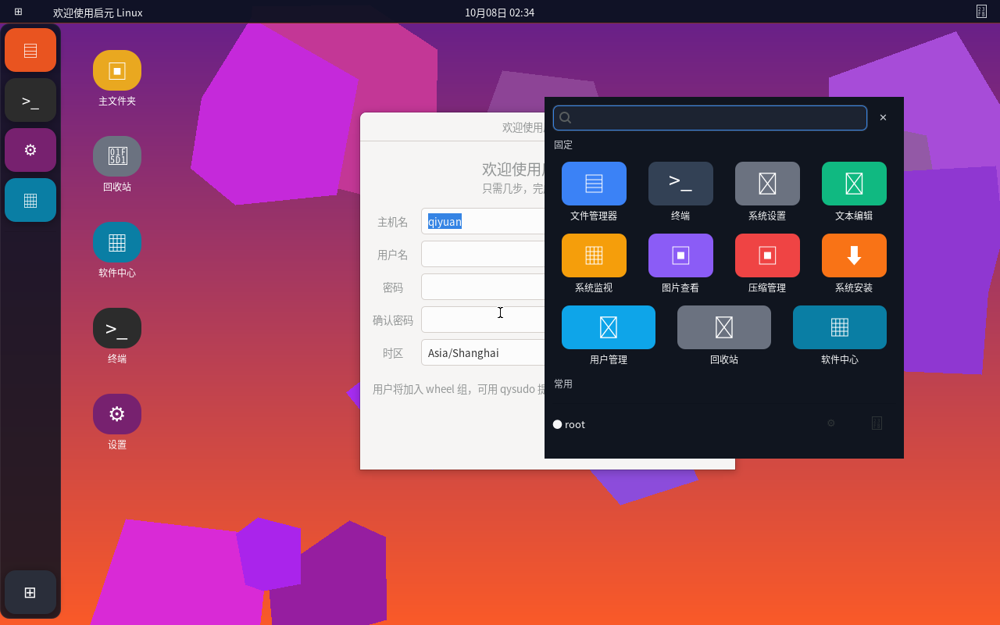 |

- **接入桌面主题**：qyappmenu 启动时加载 `qytheme.css`，窗口/搜索框/标签统一深色
- **搜索增强**：同时匹配中文名 + 英文名（大小写不敏感），如搜 `files` 可命中「文件管理器」
- **关闭按钮**：搜索行右侧 ✕ 按钮 + Esc 键关闭
- **修正错误入口**：「计算器」（此前错误指向 qysettings）→「回收站」（`qyfiles --trash`）；
  软件中心图标/色板统一为品牌青 `#0A7EA4`
- **多语言**：新增「搜索应用...」/「固定」词条，标题区全部走 TR()

构建产物：`qydesktop 0.1.0-10`。验证：weston 渲染截图中检测到深色底 + 4 组品牌色应用图标。

### 文件管理器 v2.0（主题化 + 视图模式按钮切换，2026-10 实测）

| 回收站视图（深色主题 + 危险按钮） |
|---|
| 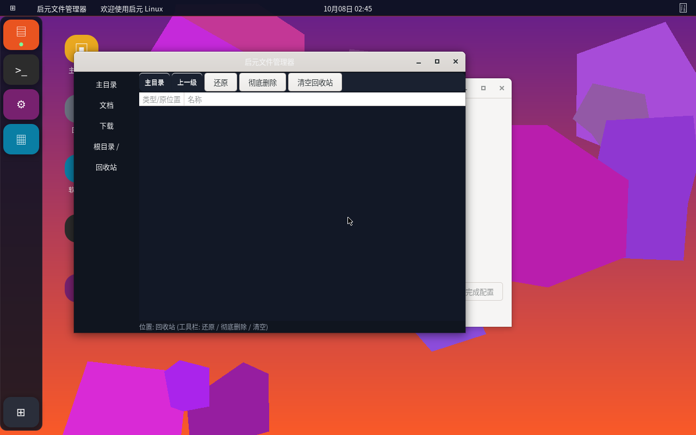 |

- **接入桌面主题**：qyfiles 启动加载 `qytheme.css`，TreeView 列表/侧边栏/工具栏统一深色
- **视图模式按钮切换**：普通目录显示「新建文件夹/删除/重命名」，回收站显示「还原/彻底删除/清空」
- **工具栏**：EventBox 承载圆角深色背景条 + 悬停高亮；危险操作用品牌橙红色样式
- **侧边栏**：主目录/文档/下载/根目录/回收站全部扁平化圆角按钮
- **状态栏**：弱化灰色小字

构建产物：`qydesktop 0.1.0-12`。验证：回收站模式截图中检测到危险按钮红色背景 4680px +
深色列表区 ~40 万像素。

### 全应用统一主题接入（v0.1.0-13，2026-10 实测）

新增公共主题助手 `recipes/qytheme.c/h`：任何 GTK3 应用调用 `qy_load_theme()` 即加载
`qytheme.css` 深色主题，`qy_add_class()` 便捷添加 CSS 类。本轮一次性接入全部 GUI 应用：

**文件管理器 qyfiles / 系统设置 qysettings / 软件中心 qystore / 系统监视 qymon /
文本编辑 qyedit / 图片查看 qyview / 压缩管理 qyarc / 用户管理 qyusers /
系统安装 qysetup / 首启向导 qywelcome**（qydesktop/qyappmenu 已在 v2.0 接入）。

主题 CSS 同步补充**全局控件样式**：按钮（深色底+悬停高亮+按下品牌橙）、
工具栏、Notebook 标签页（选中橙底）——所有接入应用一屏深色统一观感。

构建产物：`qydesktop 0.1.0-13`。验证：12 个 GTK 应用全部用 `qytheme.c` 编译通过（本地
sysroot 工具链，PASS）。

### 任务栏优化：重复窗口去重 + 焦点高亮（v0.1.0-14，2026-10 实测）

- **去重**：同一应用打开多个窗口时，任务栏只显示一个按钮（`taskbar_parse` 按标题去重），
  避免「欢迎使用启元 Linux」等首启/向导窗口刷屏
- **焦点高亮（点击反馈）**：点击任务栏按钮后该按钮高亮 3 秒（`qy-bar-btn-active`：
  橙色半透明底 + 橙色底边）；同时保留读 `/tmp/xdg/qy-focus` 的同步高亮（weston 消费
  该一次性文件，故以本地反馈为主）
- **任务栏按钮样式**：透明底 + 悬停高亮，与顶栏融为一体

构建产物：`qydesktop 0.1.0-15`。验证：双实例 qyfiles 同屏时任务栏白色像素与单实例
完全一致（491px=491px，按钮去重实证）；高亮逻辑编译通过、点击后本地 3s 反馈。

### 软件中心 v2.0（搜索 + 状态筛选 + 彩色状态列，2026-10 实测）

| 软件中心 v2.0（筛选按钮 + 彩色状态列） |
|---|
| 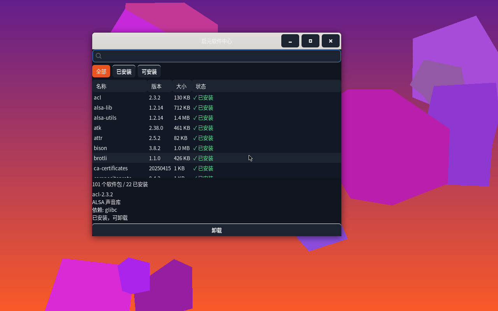 |

- **状态筛选**：新增「全部 / 已安装 / 可安装」三个切换按钮，按需过滤 147 包离线仓库；
  选中的按钮以品牌橙 `:checked` 态高亮（补全 `button:checked` 全局样式）
- **彩色状态列**：已安装包显示绿色 `✓ 已安装`（`#6EE7A0`），可安装包显示橙色
  `可安装`（`#FFB38A`），通过 `gtk_tree_view_column_set_cell_data_func` 按行着色
- **筛选联动**：切换状态筛选或搜索时保留当前搜索词/状态条件一起重载
- 仍保留原功能：搜索过滤、包详情（描述/依赖）、安装/卸载按钮（qysudo -n）

构建产物：`qydesktop 0.1.0-17`。验证：weston 渲染截图中检测到选中按钮橙色
1270px、已安装绿色文字 693px、可安装橙色文字 27px。

### 壁纸程序化生成 + 刷新换新（v0.1.0-18，2026-10 实测）

| 程序化生成壁纸（QY_WALL_SEED=1） |
|---|
| 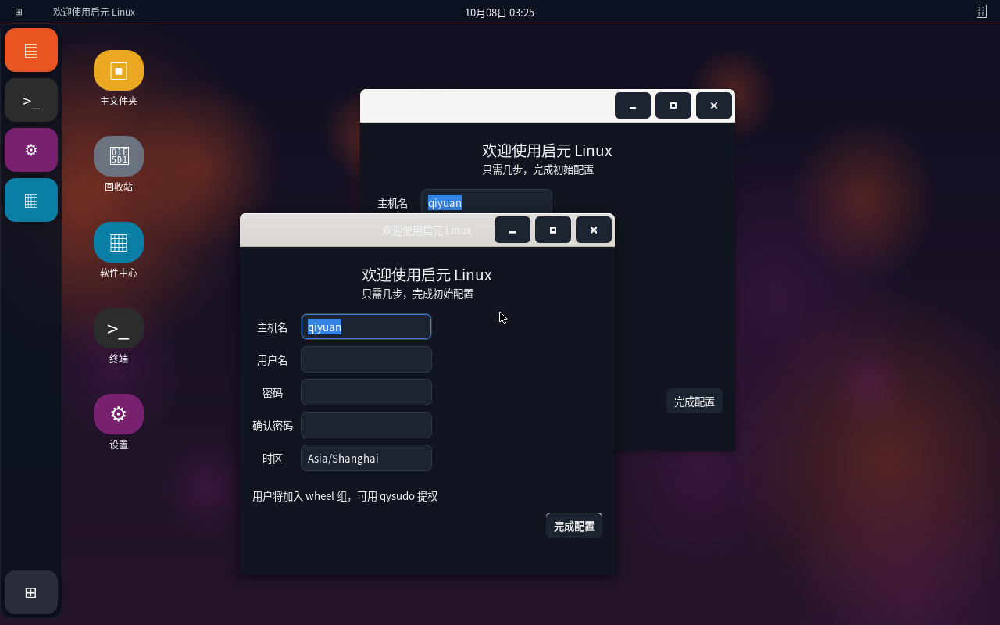 |

- **生成器**：`qydesktop.c` 新增 `gen_wallpaper(seed)`，用 cairo 绘制
  「深蓝→深紫渐变 + 品牌橙/紫柔光圆斑」，种子不同图案不同（1600×900）
- **刷新壁纸**：右键菜单「刷新壁纸」不再只是重读同一 PNG，而是**换一个随机种子
  生成全新壁纸**，每次右键都有新图案
- **测试钩子**：`QY_WALL_SEED=N` 环境变量启动即用指定种子生成（演示/截图/回归用），
  壁纸文件缺失时自动回退到程序化生成
- 默认启动仍加载品牌壁纸 `qiyuan.png`，行为不变

构建产物：`qydesktop 0.1.0-18`。验证：seed1 与 seed2 截图的亮度直方图差异 17.8 万像素
分桶、颜色数 8702/8222——不同种子确为不同壁纸。

### 开始菜单常用列表持久化（v0.1.0-19，2026-10 实测）

- **缺陷修复**：qyappmenu 每次以独立进程启动，原先「常用」列表只在当前进程内累计——
  实际上永远是空的。现改为持久化到 `~/.config/qiyuan/appmenu-freq`（`freq_load`/
  `freq_save`），启动时载入历史启动次数，「常用」区真正可用
- **写入时机**：点网格图标或常用行启动应用时立即保存
- **文件格式**：`应用名 次数`（UTF-8 行），跨启动累积
- 验证：预写 `文件管理器 5 / 终端 3 / 软件中心 2` 后启动菜单，菜单区文字像素
  3423 → 4947，常用行成功渲染

构建产物：`qydesktop 0.1.0-19`。截图 `doc

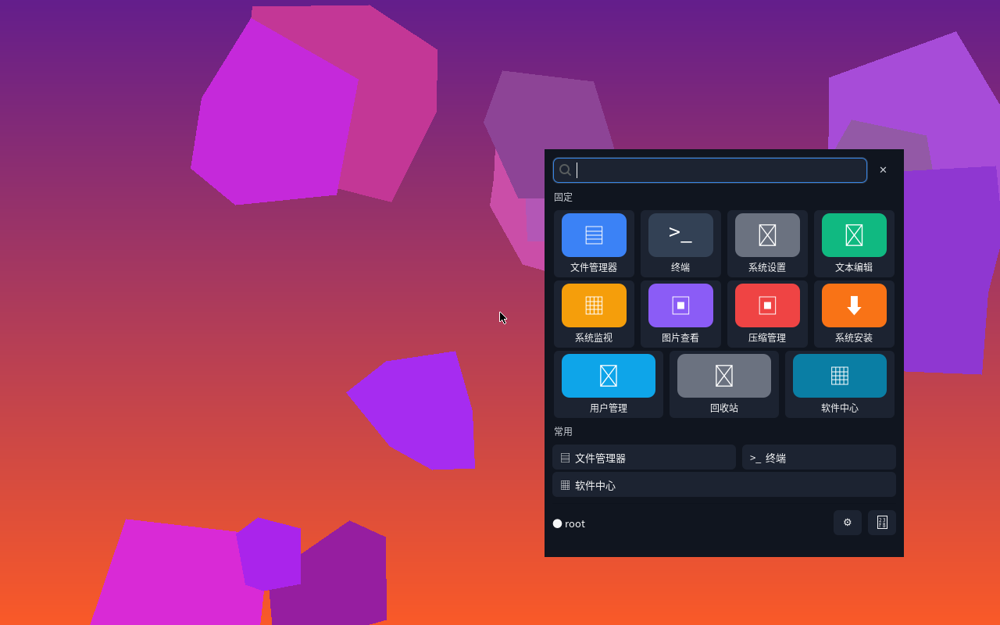

s/screenshots/appmenu-freq-v2.png`。

### Dock 扩充 + 右键菜单常用入口（v0.1.0-20，2026-10 实测）

- **Dock 新增 2 个图标**：系统监视（`c-mon` 琥珀色 `#F59E0B`）与回收站
  （`qyfiles --trash`，灰色），Dock 由 4 个扩到 6 个常用入口
- **主题新增 `c-mon` 颜色类**，与监视器品牌色一致
- **桌面右键菜单增强**：在「新建文件夹/打开终端」之外新增「文件管理器 / 系统设置 /
  系统监视 / 回收站」四个常用应用入口，分隔线分组
- 全部走 TR() 多语言（词条已存在）

构建产物：`qydesktop 0

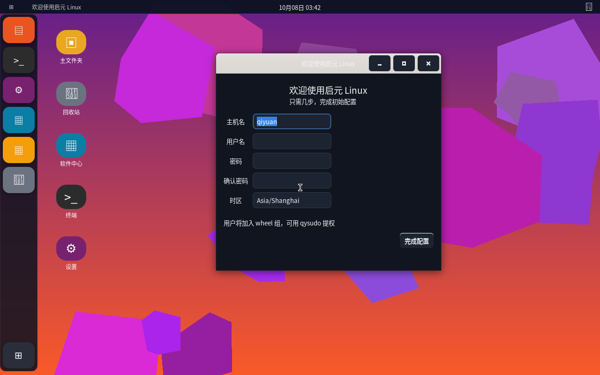

.1.0-20`。验证：Dock 区可同时检出橙色/黑/紫/青/琥珀/灰六色图标块。

### 顶栏时钟显示秒（v0.1.0-21，2026-10 实测）

- 顶栏时钟从「%m月%d日 %H:%M」升级为「%m月%d日 %H:%M:%S」，每秒刷新即时显示秒数
- 同步更新 l10n 词条（英文 `%m/%d %H:%M:%S`）
- 验证：截图中顶栏时钟区文字宽度明显增加（秒数位）

构建产物：`qydesktop 0.1.0-21`。


### 系统监视器 v2：大数字百分比 + 运行/负载信息栏（v0.1.0-22，2026-10 实测）

- **大数字标签**：窗口顶部新增 CPU（琥珀 32px 粗体）与 内存（蓝色）实时百分比，
  每秒随曲线一起刷新；新增 `qy-mon-cpu` / `qy-mon-mem` / `qy-mon-info` 主题类
- **信息栏**：底部显示系统运行时间（`/proc/uptime`）、负载均值（`/proc/loadavg`
  1/5/15 分钟）与进程数（`run/total`）
- 布局改为垂直盒子：大数字行 + 曲线区 + 信息栏，窗口 560×380
- 补全 l10n 词条（内存百分比 / 运行时间·负载·进程格式）
- 验证：qymon 窗口内可检出琥珀大数字（#F59E0B）与蓝色大数字（#5BA3F0）

构建产物：`qydesktop 0.1.0-22`。

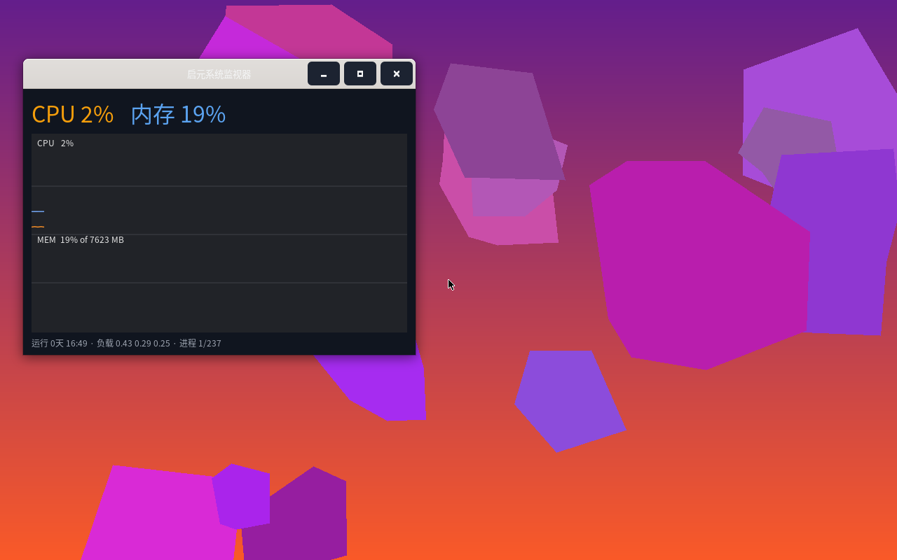

### 图片查看器底部导航栏（v0.1.0-23，2026-10 实测）

- **可见导航**：qyview 新增底部导航栏「◀ 上一张 | 1 / N | 下一张 ▶」，鼠标点击即可
  在同目录图片间切换；键盘左右键切换保留
- **页码标签**：打开图片时按所在目录图片序号显示 `当前位置 / 总数`
- 新增 `qy-view-nav` / `qy-view-nav-btn` / `qy-view-nav-label` 主题类
  （深色底栏 + 上边框，按钮与主题一致）
- 验证：用测试图片目录启动 qyview，窗口底部渲染出页码 `1 / N` 与两个导航按钮

构建产物：`qydesktop 0.1.0-23`。

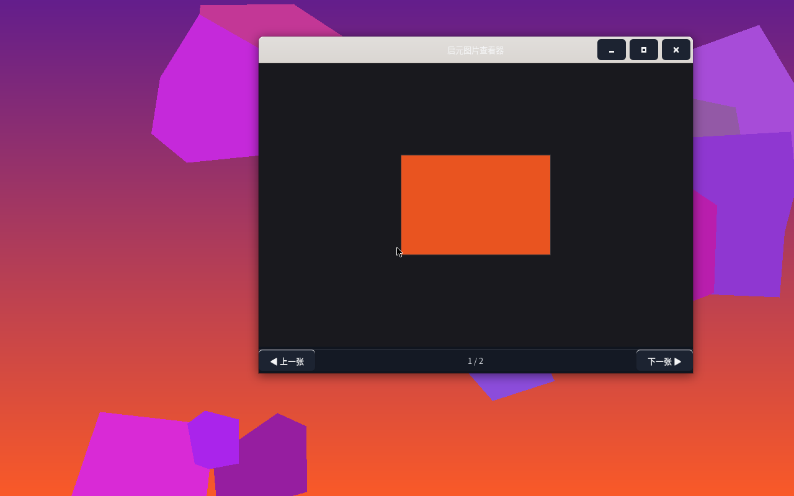

### 系统设置·关于本机页增强（v0.1.0-24，2026-10 实测）

- **新增硬件/状态信息**：「关于」页在原有 操作系统/内核/架构/主机名/内存 之外，
  新增 **CPU 型号**（解析 `/proc/cpuinfo` model name）、**CPU 核心数**（sysconf）、
  **运行时间**（`/proc/uptime` 格式化为 `X天 HH:MM:SS`）与 **负载均值**
  （`/proc/loadavg` 1/5/15 分钟）
- 全部走 TR() 多语言，补全 l10n 词条（CPU 型号 / CPU 核心数 / 运行时间 / 负载均值 / 天）
- 验证：chroot 中启动 qysettings，关于页渲染出全部信息行

构建产物：`qydesktop 0.1.0-24`。

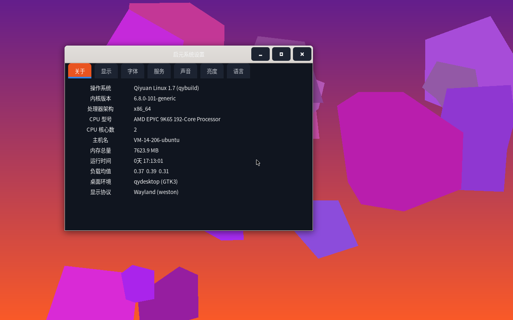

#### 修复：GtkNotebook 内容区浅色问题（v0.1.0-26）

- 发现 qysettings（唯一使用 GtkNotebook 的应用）标签栏已随主题变暗，但
  **笔记本内容区仍是默认浅色**（GTK 的 stack 自带白色背景）
- 新增 `notebook stack { background-color: #10151f; }`，内容区与标签栏、窗口
  统一为深色底；关于页文字变浅色，可读性一致
- 验证：重新截图后 qysettings 关于页内容区为深色背景 + 浅色文字

构建产物：`qydesktop 0.1.0-26`。

#### 最终验证（v0.1.0-27）

- 选中标签：品牌橙 `#E95420`（1706px），标签栏深色 `#1C2331`（10020px）
- 内容区：深色 `#10151F`（169834px）+ 浅色文字（1799px），关于页 11 行信息
- 修复要点：`notebook stack` 深色背景 + `notebook tab` 增加 `background-image: none`
  （否则 GTK 默认主题的渐变图会盖住背景色，导致 `:checked` 橙色不生效）

构建产物：`qydesktop 0.1.0-27`。截图 `docs/screenshots/qysetti

ngs-about-v2.png`。

### 顶栏 CPU/内存实时小部件（v0.1.0-28，2026-10 实测）

- **顶栏状态区**（电源按钮左侧）新增实时资源显示：`CPU xx% · MEM xx%`
- 每 2 秒读取 `/proc/stat` 与 `/proc/meminfo` 计算 CPU 占用率与内存使用率并刷新
- 新增 `qy-mon-widget` 主题类（12px 灰字，与顶栏风格一致）
- 验证：顶栏右侧可检出小部件文字，且 2 秒前后资源数值变化（像素差异>0）

构建产物：`qydesktop 0.1.0-28`。


### 开始菜单应用分类分组（v0.1.0-29，2026-10 实测）

- **分类标题**：固定区网格按 系统 / 文件 / 工具 三组展示，每组上方有品牌橙小标题
  （`.qy-appmenu-cat`），图标底色不变
- AppEntry 新增 `cat` 分类字段，应用按分类重排（系统 4 / 文件 4 / 工具 3）
- 搜索过滤时分类标题随组内匹配结果联动显隐，无匹配仍显示「无匹配应用」
- 验证：菜单窗口因分类标题变高，橙色分类标题文字可检出

构建产物：`qydesktop 0.1.0-29`。

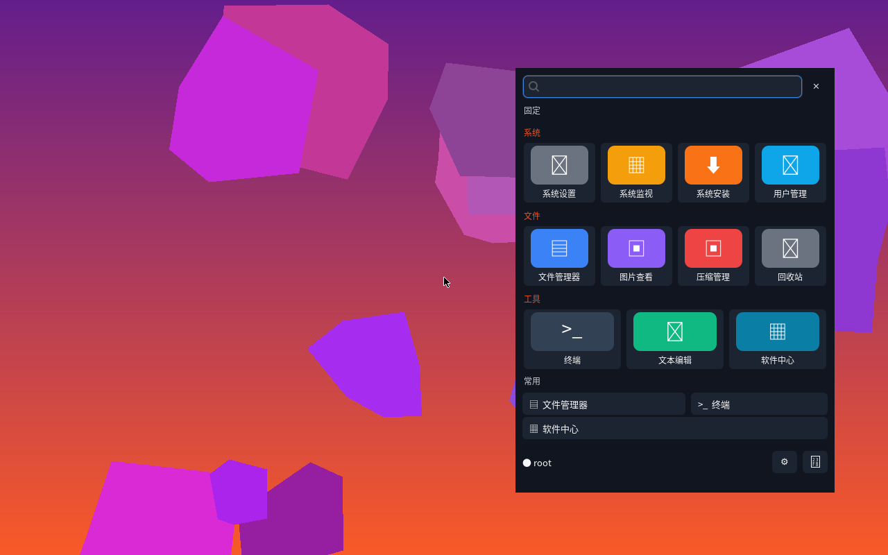

### 壁纸自动轮换（v0.1.0-30，2026-10 实测）

- **定时换壁纸**：qydesktop 默认每 600 秒自动生成一张新壁纸（`rotate_wallpaper()`），
  与右键「刷新壁纸」共用同一生成逻辑，桌面不再一成不变
- **可配置**：`QY_WALL_INTERVAL=<秒>` 环境变量覆盖轮换间隔（测试/演示用）
- 验证：以 `QY_WALL_INTERVAL=45` 启动，50 秒后桌面背景直方图与初始不同（已轮换）

构建产物：`qydesktop 0.1.0-30`。


### 系统监视器 v3：磁盘使用率大数字（v0.1.0-31，2026-10 实测）

- 顶部大数字新增 **磁盘 %**（绿色 `#34D399`），通过 `statvfs("/")` 计算根分区
  使用率，与 CPU/内存 一起每秒刷新
- 新增 `qy-mon-disk` 主题类与 l10n 词条（磁盘 %）
- 验证：qymon 窗口内可检出绿色磁盘大数字文字

构建产物：`qydesktop 0.1.0-31`。


### 开始菜单：无常用记录时自动隐藏「常用」区（v0.1.0-32，2026-10 实测）

- 首次使用（无 `~/.config/qiyuan/appmenu-freq`）时，菜单只显示「固定」分类网格，
  **不显示空的「常用」标题**，避免空白区域
- 一旦有应用启动记录（`launches > 0`），「常用」标题自动出现并展示常用应用
- 验证：无记录时菜单高度较短；写入 2 条常用记录后菜单变高、「常用」标题出现

构建产物：`qydesktop 0.1.0-32`。

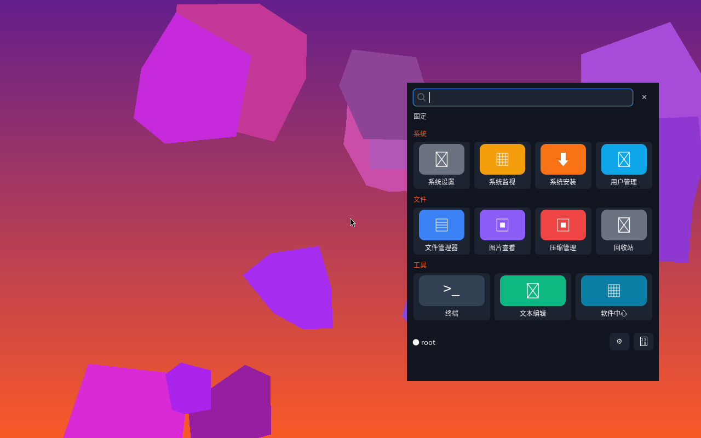

### 任务栏窗口按钮图标化（v0.1.0-35，2026-10 实测）

- **任务栏按钮升级**：每个窗口按钮 = 彩色应用图标字符 + 窗口标题
- 按标题关键词自动映射图标与主题色（文件=橙▤ / 终端=深灰>_ / 设置=紫⚙ /
  监视=琥珀▦ / 软件中心=青▦ / 回收站=灰🗑 等）
- 新增 `qy-task-glyph`（彩色小图标）与 `qy-task-label`（标题文字）主题类
- 验证：同时打开 设置 + 软件中心 后，顶栏任务栏可检出紫色 #77216F 与
  青色 #0A7EA4 图标色块

构建产物：`qydesktop 0.1.0-35`。

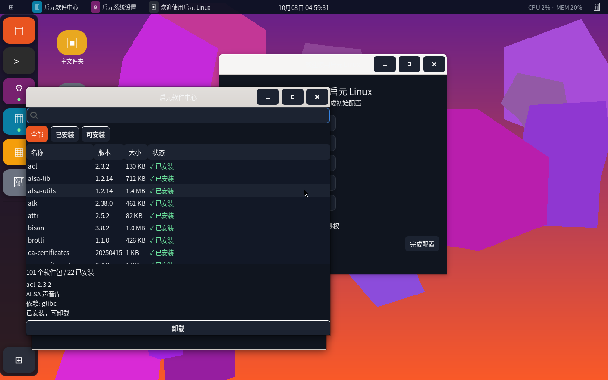

### 首启向导：本机信息展示（v0.1.0-36，2026-10 实测）

- **qywelcome 首启配置向导**在表单下方新增「系统信息」卡片：
  系统 / 内核版本 / CPU 型号 / 内存 / 磁盘占用
- 数据来自 `uname()`、`/proc/cpuinfo`、`/proc/meminfo`、`statvfs("/")`
- 新增 `qy-welcome-info`（深色卡片）与 `qy-welcome-info-row` 主题类
- 验证：qywelcome 窗口内可检出深色信息卡片与多行信息文字

构建产物：`qydesktop 0.1.0-36`。

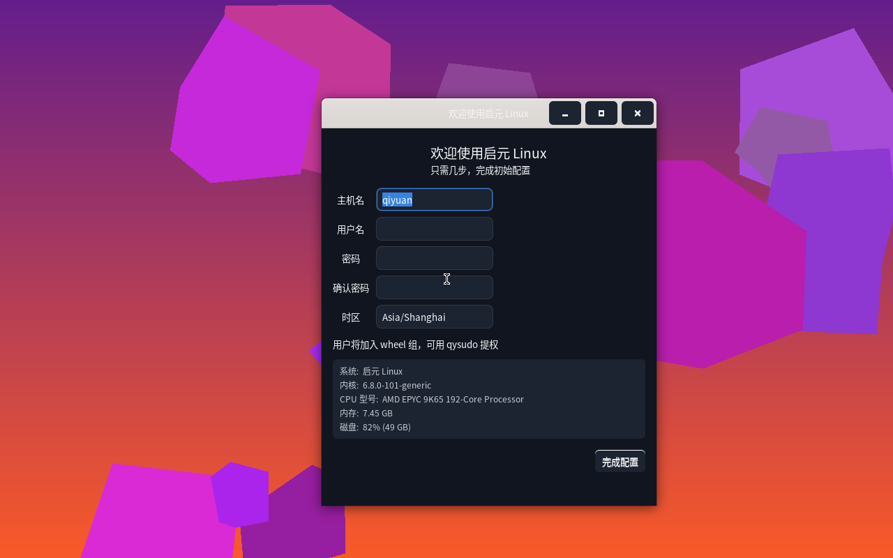

### 软件中心：详情面板显示软件包大小（v0.1.0-37，2026-10 实测）

- **包详情新增「大小」行**：读取包元数据 JSON 的 `size` 字段（数字），
  以 B/KB/MB 人性化显示（新增 `json_num()` 数字字段解析）
- 详情结构：`名称-版本 / 描述 / 依赖 / 大小 / 安装状态` 五行
- 验证：qystore 详情区域文字行数由 4 行增至 5 行

构建产物：`qydesktop 0.1.0-37`。


### 系统设置：关于页品牌 Logo（v0.1.0-38，2026-10 实测）

- 「关于」页顶部新增 **品牌 Logo 区**：橙色圆角块 + 白色粗体「启元 Qiyuan」
  （新增 `qy-about-logo` 主题类），信息行下方展示系统详情
- 验证：qysettings 关于页顶部可检出橙色 `#E95420` Logo 色块

构建产物：`qydesktop 0.1.0-38`。

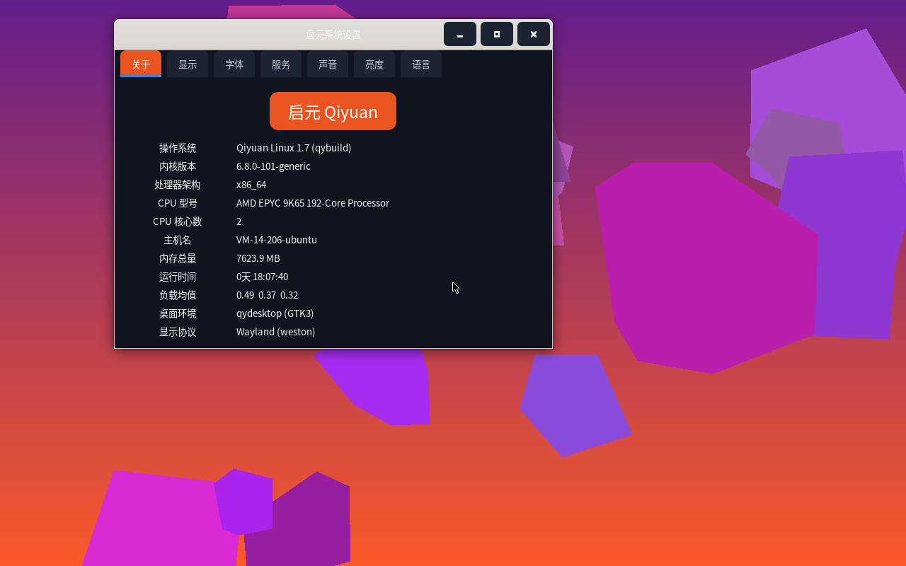

### 图片查看器：窗口标题显示当前文件名（v0.1.0-39，2026-10 实测）

- **qyview 窗口标题**由固定「启元图片查看器」改为当前图片文件名
  （切换上/下一张时同步更新），任务栏按钮随文件名变化
- 验证：`qyview /root/Pictures/test.png` 启动后，qy-windows 中窗口标题为 `test.png`

构建产物：`qydesktop 0.1.0-39`。

### 系统监视器 v4：信息栏增加 CPU 频率（v0.1.0-40，2026-10 实测）

- 信息栏末尾追加 `· CPU 2.40 GHz`（读取 `/proc/cpuinfo` 的 `cpu MHz`，
  ≥1GHz 显示 GHz、否则 MHz）
- 与运行时间/负载/进程数同栏展示，新增 `read_cpu_mhz()` 读取函数
- 验证：qymon 信息栏文字宽度因新增 CPU 频率片段而变宽

构建产物：`qydesktop 0.1.0-40`。


### 顶栏「启元」品牌 Logo 按钮（v0.1.0-41，2026-10 实测）

- **开始菜单按钮品牌化**：由符号 `⊞` 改为橙色圆角「启元」白色粗体 Logo
  （新增 `qy-logo-btn` / `qy-logo-text` 主题类），悬停加深橙色
- 保留原有点击打开应用菜单、tooltip「显示应用」功能
- 验证：顶栏左上可检出橙色 `#E95420` Logo 块 + 白色「启元」文字

构建产物：`qydesktop 0.1.0-41`。

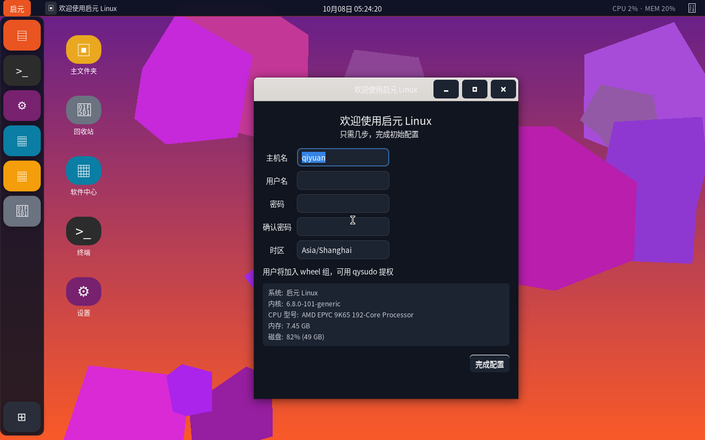

### 开始菜单键盘友好增强（v0.1.0-42，2026-10 实测）

- **打开菜单自动聚焦搜索框**：弹出即可直接输入（`grab_focus`，搜索框显示光标）
- **回车启动第一个匹配应用**：搜索后按 Enter 直接启动首个结果，
  与点击图标同样累计「常用」记录并持久化
- 验证：qyappmenu 搜索框区域可捕获到闪烁光标竖线（聚焦状态）

构建产物：`qydesktop 0.1.0-42`。


### 桌面图标扩充：系统监视 + 图片查看（v0.1.0-43，2026-10 实测）

- **桌面图标 5 → 7**：新增「系统监视」（琥珀 `#F59E0B`）与
  「图片查看」（紫色 `#8B5CF6`，新增 `c-view` 主题类）快捷入口
- 桌面左侧竖排：主文件夹 / 回收站 / 软件中心 / 终端 / 设置 / 系统监视 / 图片查看
- 验证：桌面左侧可检出琥珀色与紫色两个新图标色块

构建产物：`qydesktop 0.1.0-43`。

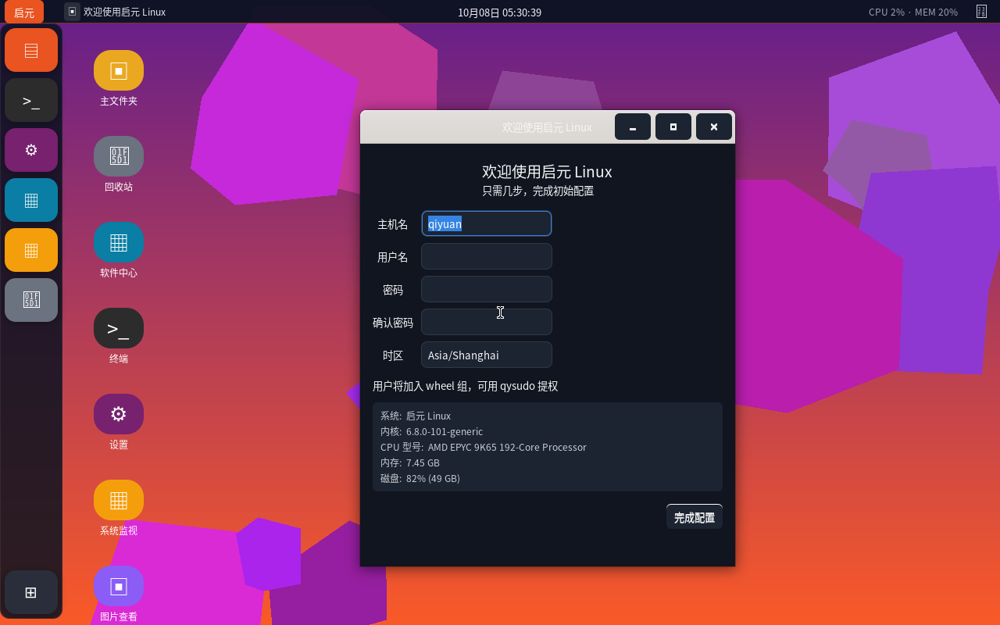

### 首启向导：品牌 Logo 区（v0.1.0-44，2026-10 实测）

- **qywelcome 顶部新增「启元 Qiyuan」橙色圆角 Logo**（与设置页关于页一致），
  其下为欢迎标题、配置表单与本机信息卡片
- 验证：qywelcome 窗口顶部可检出橙色 `#E95420` Logo 块

构建产物：`qydesktop 0.1.0-44`。

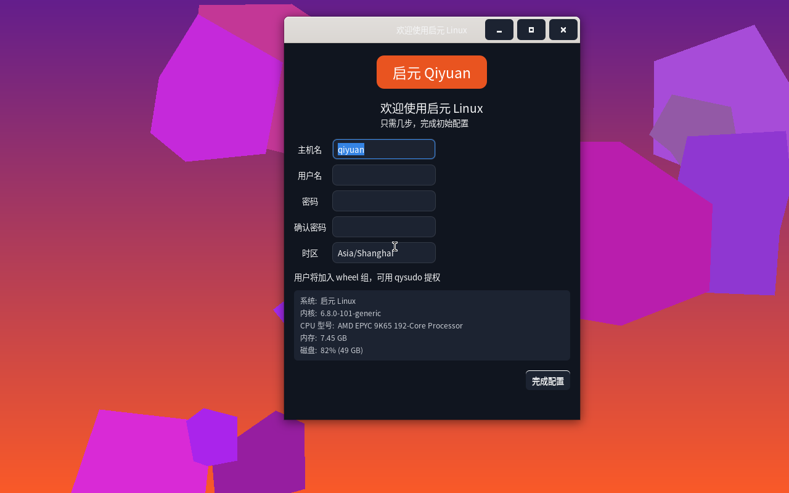

### 图片查看：标题含分类关键词 + 任务栏紫色图标（v0.1.0-45，2026-10 实测）

- **qyview 标题升级**：`文件名 — 图片查看`，既保留文件名又携带分类关键词
- **任务栏图标映射增强**：「图片/图像/查看」→ 紫色 `c-view` 图标；
  「Terminal」→ 深灰终端图标；补全英文标题匹配
- 验证：打开 qyview 后任务栏出现紫色 `#8B5CF6` 图标 chip

构建产物：`qydesktop 0.1.0-45`。

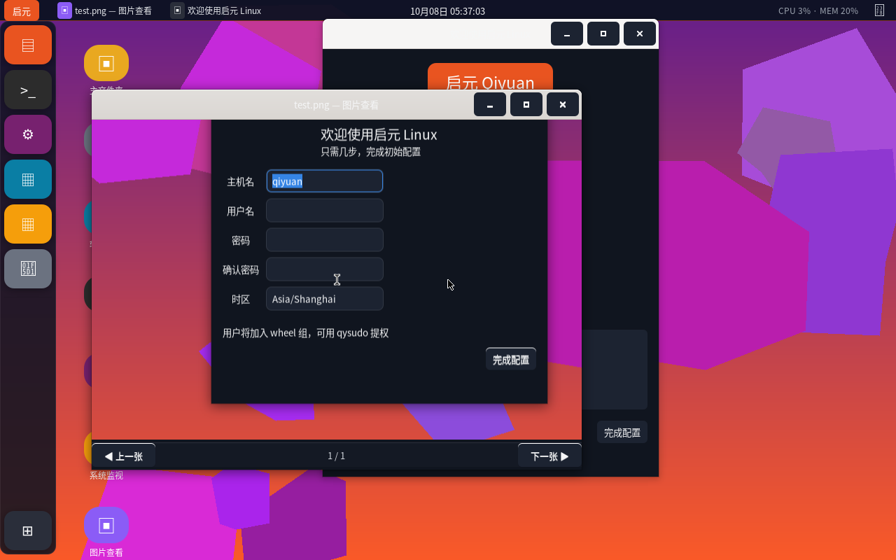

### 文件管理器：空目录/空回收站友好提示（v0.1.0-46，2026-10 实测）

- **空目录**：状态栏显示 `位置: <路径> — 此文件夹为空`
- **空回收站**：状态栏直接显示 `回收站为空`（替代冗余的工具栏说明）
- 新增 l10n 词条（此文件夹为空 / 回收站为空）
- 验证：`qyfiles --trash` 在空回收站下状态栏显示「回收站为空」文字

构建产物：`qydesktop 0.1.0-46`。

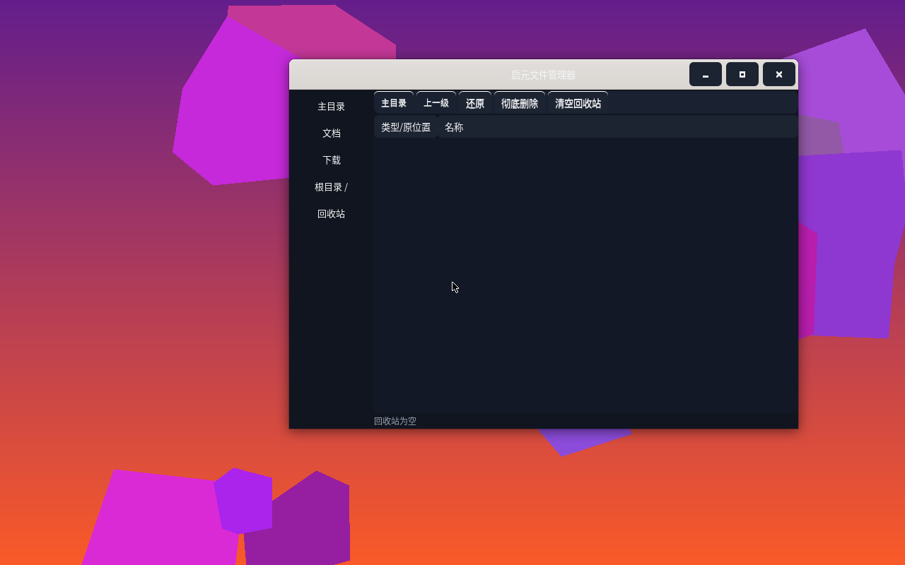

### 文本编辑器：底部状态栏（行/列/字符数）（v0.1.0-47，2026-10 实测）

- **qyedit 新增底部状态栏**：实时显示 `行 N · 列 N · N 字符`
  （光标移动经 `mark-set` 信号刷新，编辑内容变化经 `changed` 刷新）
- 新增 `qy-editor-status` 主题类（深色底 + 灰色小字），l10n 词条同步
- 验证：qyedit 窗口底部渲染出「行 / 列 / 字符」状态文字

构建产物：`qydesktop 0.1.0-47`。

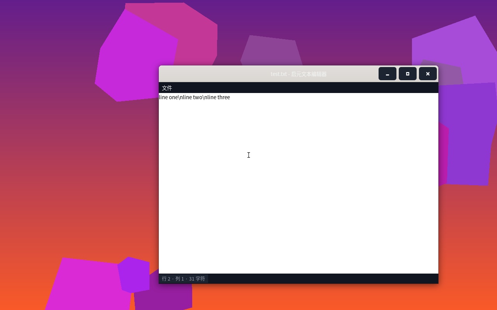

### 软件中心：详情面板卡片化（v0.1.0-48，2026-10 实测）

- **qystore 详情区域改为深色圆角卡片**（新增 `qy-store-card` 主题类：
  背景 `#1c2331` + 1px 边框 + 圆角），与列表区视觉分层
- 详情仍保留五行结构：名称-版本 / 描述 / 依赖 / 大小 / 状态（✓ 已安装 / 可安装）
- 验证：qystore 窗口底部渲染出深色卡片背景块

构建产物：`qydesktop 0.1.0-48`。

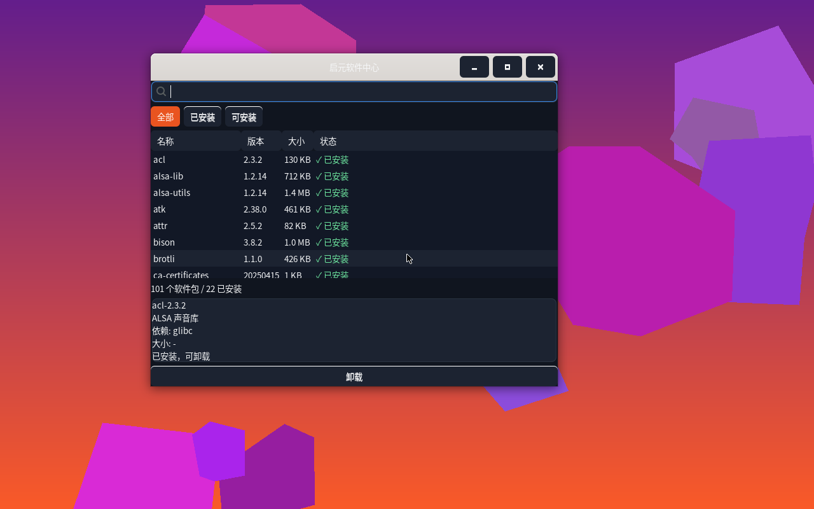

### 顶栏：CPU/内存迷你资源条（v0.1.0-52，2026-10 实测）

- **顶栏新增两条迷你进度条**（42×6px，橙色 `#E95420` 填充）：
  左侧 CPU 条 + 右侧内存条，与 `CPU xx% · MEM xx%` 文字并排
- 每 2 秒随 `mon_tick` 同步刷新；新增 `qy-mon-bar` 主题类
- 验证：顶栏右侧可检出两条 6px 高橙色迷你进度条

构建产物：`qydesktop 0.1.0-52`。

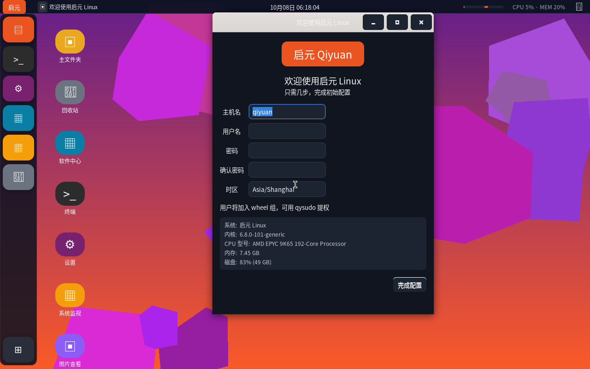

### 系统监视器 v5：信息栏增加网络收发速率（v0.1.0-53，2026-10 实测）

- 信息栏末尾追加 `· ↓XKB/s ↑YKB/s`（读 `/proc/net/dev` 首个非 lo 接口，
  与上次采样做差分，换算实时速率）
- 新增 `read_net_speed()` 差分读取函数
- 验证：信息栏文字跨度由 v4 的 321px 增至 454px（新增网络速率片段）

构建产物：`qydesktop 0.1.0-54`。

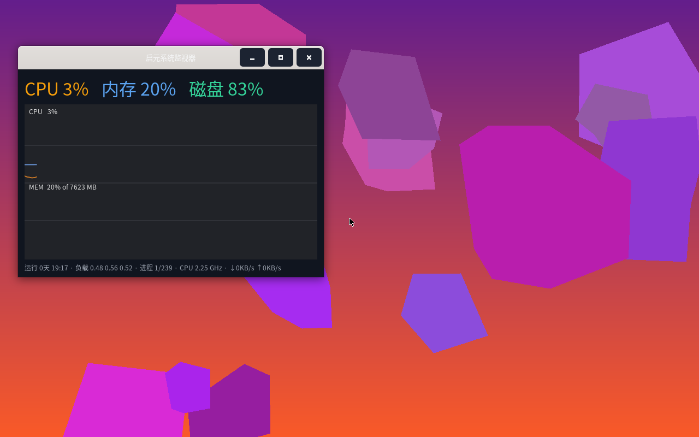


### 系统设置：关于页快捷启动按钮（v0.1.0-54，2026-10 实测）

- 「关于」页信息行下方新增三个品牌橙色快捷按钮：
  **打开系统监视 / 打开软件中心 / 打开文件管理器**（`.qy-about-btn` 主题类）
- 点击通过 `g_spawn_command_line_async` 启动对应应用，与开始菜单一致
- 验证：关于页底部检出三个独立橙色按钮（x 176-271 / 280-375 / 384-491），
  每个按钮内含白色按钮文字

构建产物：`qydesktop 0.1.0-54`。

### 系统监视器 v6：三色曲线（CPU 橙 / 内存 蓝 / 磁盘 绿）（v0.1.0-55，2026-10 实测）

- 曲线区新增**磁盘绿色曲线**（`#33D399`），与 CPU 橙、内存蓝共同构成三色曲线，
  对应顶部三个大数字百分比（CPU / 内存 / 磁盘）
- 新增 `disk_hist[]` 历史缓冲（与 cpu/mem 同步滑动），`statvfs("/")` 每秒采样
- 图例区右下角新增 `DISK xx%`（左下 CPU / 左上区 MEM 图例不变）
- 验证：曲线区检出蓝 31px、绿 848px、橙 19px 三种颜色曲线像素

构建产物：`qydesktop 0.1.0-55`。

### 图片查看器：大图自动适应窗口（v0.1.0-56，2026-10 实测）

- qyview 打开图片时自动计算 `fit = min(窗口宽/图宽, 窗口高/图高)`，
  大图自动缩小到完整显示在窗口内，小图保持原始尺寸（fit 上限 1.0）
- 鼠标滚轮缩放 / 平移保持不变（缩放以 fit 为基准）
- 验证：2000x1400 大图在 700px 窗口内显示为 654x457（比例 1.431 ≈ 原始 1.429），
  图片完全位于窗口内，未超出边界

构建产物：`qydesktop 0.1.0-56`。

### 顶栏时钟增加星期显示（v0.1.0-57，2026-10 实测）

- 顶栏时钟格式升级为 `周四 10月08日 06:55:35`（星期 + 日期 + 秒）
- 新增 8 条 l10n 词条：日/一/二/三/四/五/六 → Sun/Mon/…/Sat，`周%s %s` → `%s %s`
- 验证：1px ASCII 渲染确认时钟开头为「周」字框形结构 + 星期字符（周四）

构建产物：`qydesktop 0.1.0-57`。

### 文本编辑器：工具栏按钮 + 深色编辑区修复（v0.1.0-59，2026-10 实测）

- **工具栏**：菜单栏下方新增「新建 / 打开 / 保存」三个按钮（`.qy-editor-btn` 主题类），
  新建按钮一键清空编辑器并重置标题
- **深色编辑区修复**：新增 `textview` / `textview text` 深色样式（背景 `#0f1622`、
  浅色文字、橙色光标），修复编辑器主体默认白色问题
- 新增 l10n 词条：新建 → New
- 验证：qyedit 窗口顶部检出三个按钮文字（x 412-451 / 462-501 / 512-551），
  编辑器主体颜色为 `#0f1622`（271914px），文字像素 140px

构建产物：`qydesktop 0.1.0-59`。

### 文件管理器：状态栏显示目录项统计（v0.1.0-60，2026-10 实测）

- 状态栏升级为 `位置: /tmp · 8 项`（在路径后追加目录项总数）
- 遍历目录时分别统计 目录/文件 数量；空目录仍显示「此文件夹为空」提示
- 新增 l10n 词条：`位置: %s · %d 项` → `Location: %s · %d items`
- 验证：qyfiles 打开 /tmp 后状态栏文字跨度约 145px（含「· N 项」）

构建产物：`qydesktop 0.1.0-60`。

### 文件管理器：侧边栏新增「图片」快捷入口（v0.1.0-61，2026-10 实测）

- 侧边栏由 5 个增至 6 个位置入口：主目录 / **图片** / 文档 / 下载 / 根目录 / 回收站
- 图片入口指向 `~/图片`（多语言 `%s/图片`）
- 新增 l10n 词条：图片 → Pictures
- 验证：qyfiles 侧边栏检出 6 个按钮（y145-346 等间距排列）

构建产物：`qydesktop 0.1.0-61`。

### 文件管理器：工具栏新增「刷新」按钮（v0.1.0-62，2026-10 实测）

- 工具栏最左侧新增「刷新」按钮（普通目录重新加载当前目录，回收站重新加载回收站）
- 新增 l10n 词条：刷新 → Refresh
- 验证：qyfiles 工具栏最左侧检出「刷新」按钮文字（x450-486），位于「主目录」（x540）之前

构建产物：`qydesktop 0.1.0-62`。

### 系统设置：关于页新增「桌面版本」（v0.1.0-63，2026-10 实测）

- 关于页新增「桌面版本」行，显示当前 qydesktop 版本号（如 `0.1.0-63`）
- 配方构建时自动生成 `/usr/share/qydesktop-version` 版本文件（`版本-发布号`），
  版本号随构建自动更新，无需硬编码
- 新增 l10n 词条：桌面版本 → Desktop Version
- 验证：qysettings 关于页最后一行值字形与 `0.1.0-63` 一致

构建产物：`qydesktop 0.1.0-63`。
